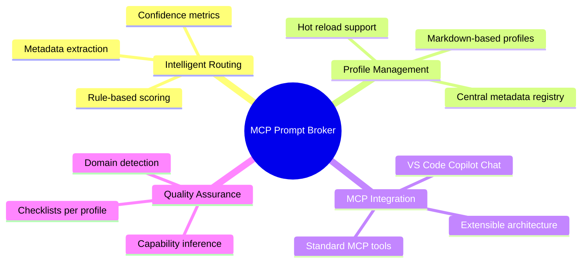
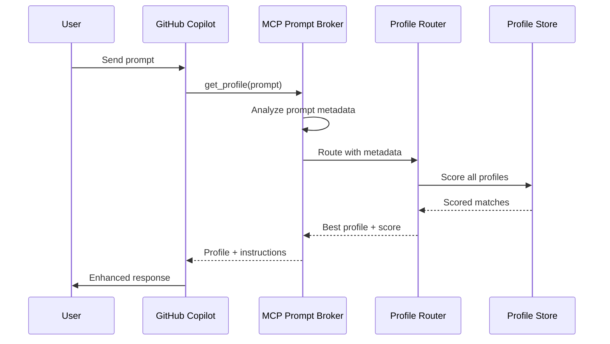
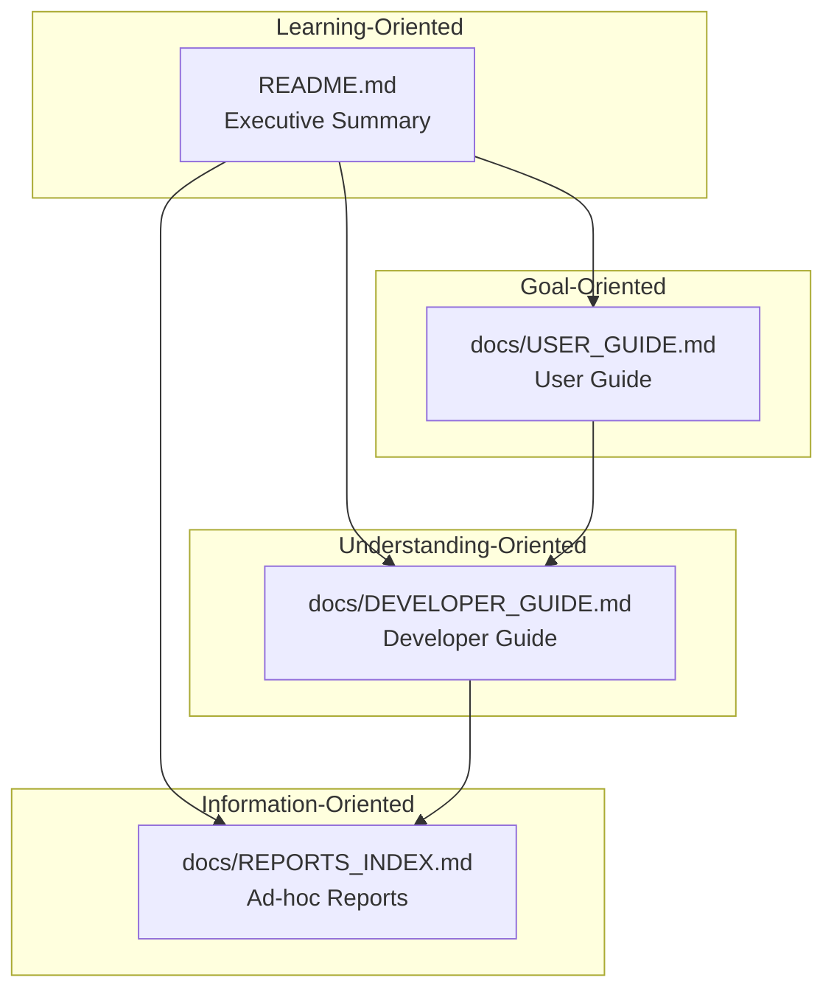

# MCP Prompt Broker

<div align="center">


**Intelligent instruction routing for AI agents using the Model Context Protocol**

[User Guide](docs/USER_GUIDE.md) • [Developer Guide](docs/DEVELOPER_GUIDE.md) • [Reports](docs/REPORTS_INDEX.md)

</div>

---

## Executive Summary

**MCP Prompt Broker** is a Python-based Model Context Protocol (MCP) server that dynamically selects the optimal instruction profile for user prompts. It enables AI assistants like GitHub Copilot to automatically apply context-specific guidance, improving response quality across diverse domains including creative ideation, technical troubleshooting, privacy-sensitive operations, and general-purpose interactions.

### Key Value Proposition

| Challenge | Solution |
|-----------|----------|
| One-size-fits-all AI instructions | Context-aware profile routing |
| Static AI behavior | Hot-reloadable markdown profiles |
| Limited domain expertise | Specialized profiles for creative, technical, privacy, and general tasks |
| Opaque routing decisions | Transparent scoring with confidence metrics |

### Core Capabilities



---

## Quick Start

### Prerequisites

- Python 3.10 or higher
- VS Code with GitHub Copilot Chat extension (optional)

### Installation

**Option 1: Automated Installation (Windows)**

```powershell
git clone https://github.com/michaelprinc/MCP_prompt_broker.git
cd MCP_prompt_broker
./install.ps1
```

This installs:
- ✅ MCP Prompt Broker server
- ✅ MCP server configuration (global + workspace)
- ✅ **Companion custom agent** for GitHub Copilot Chat

**Option 2: Manual Installation**

```bash
git clone https://github.com/michaelprinc/MCP_prompt_broker.git
cd MCP_prompt_broker
python -m pip install .
```

### Running the Server

```bash
python -m mcp_prompt_broker
```

Or with custom profiles directory:

```bash
python -m mcp_prompt_broker --profiles-dir /path/to/profiles
```

---

## How It Works



### Profile Routing Process

1. **Prompt Analysis**: Extracts metadata (intent, domain, sensitivity, topics)
2. **Profile Matching**: Evaluates each profile's required conditions
3. **Weighted Scoring**: Applies domain-specific weights to calculate scores
4. **Confidence Calculation**: Uses softmax-style normalization for consistency metrics
5. **Response**: Returns best-matching profile with instructions and checklist

---

## Available Profiles

| Profile | Use Case | Complexity |
|---------|----------|------------|
| `general_default` | General-purpose fallback | Standard |
| `creative_brainstorm` | Ideation and creative thinking | Standard |
| `technical_support` | Troubleshooting and debugging | Standard |
| `privacy_sensitive` | GDPR/HIPAA compliant operations | Standard |
| `*_complex` | Enhanced versions with meta-cognition | Complex |

---

## Companion Custom Agent

**Companion** is an intelligent AI assistant that automatically routes your requests to optimal instruction profiles using MCP Prompt Broker.

### Using Companion in GitHub Copilot Chat

After installation, use the Companion agent with the `@companion` mention:

```
@companion Generate creative names for a fitness tracking app
@companion Debug this Python KeyError on line 42
@companion Analyze this medical data with privacy compliance
```

### How Companion Works

1. **Automatic Profile Selection**: Every request is analyzed via `get_profile` tool
2. **Context-Aware Instructions**: Applies domain-specific guidance automatically
3. **Optimal Response Quality**: Leverages specialized profiles (creative, technical, privacy, general)
4. **Transparent Routing**: Shows which profile was selected and why

### Companion Benefits

| Without Companion | With Companion |
|-------------------|----------------|
| Generic AI responses | Domain-optimized responses |
| Manual instruction writing | Automatic instruction routing |
| Inconsistent quality | Profile-based consistency |
| One-size-fits-all | Context-aware adaptation |

See [User Guide](docs/USER_GUIDE.md) for detailed Companion usage instructions.

---

## MCP Tools Reference

| Tool | Description |
|------|-------------|
| `list_profiles` | List all available instruction profiles |
| `get_profile` | Analyze prompt and return best-matching profile |
| `reload_profiles` | Hot-reload profiles from markdown files |
| `get_checklist` | Get quality checklist for a specific profile |
| `get_registry_summary` | Get metadata registry statistics |
| `find_profiles_by_capability` | Find profiles by capability (e.g., "ideation") |
| `find_profiles_by_domain` | Find profiles by domain (e.g., "healthcare") |

---

## Documentation Structure

This project follows the **Diátaxis documentation framework**, providing four distinct types of documentation:



| Level | Document | Purpose | Audience |
|-------|----------|---------|----------|
| 1 | [README.md](README.md) | Executive summary, quick start | Everyone |
| 2 | [User Guide](docs/USER_GUIDE.md) | Installation, configuration, usage | End users |
| 3 | [Developer Guide](docs/DEVELOPER_GUIDE.md) | Architecture, API, contribution | Developers |
| 4 | [Reports Index](docs/REPORTS_INDEX.md) | Development history, decisions | Maintainers |

### Documentation Methodology

This documentation was created following these principles:

- **Diátaxis Framework**: Separates tutorials, how-to guides, explanations, and references
- **Progressive Disclosure**: Information complexity increases with document depth
- **Cross-Referencing**: All documents are interconnected for easy navigation
- **Visual Documentation**: Mermaid diagrams for processes and architecture
- **Living Documentation**: Reports track development history and decisions

---

## Project Structure

```
MCP_Prompt_Broker/
├── .github/
│   └── agents/
│       ├── companion-instructions.md  # Companion agent instructions
│       ├── companion-agent.json       # Agent definition (reference)
│       └── README.md                  # Agent directory documentation
├── src/
│   └── mcp_prompt_broker/
│       ├── server.py              # MCP server entry point
│       ├── profile_parser.py      # Markdown profile parser
│       ├── metadata_registry.py   # Central metadata management
│       ├── config/
│       │   └── profiles.py        # InstructionProfile class
│       ├── metadata/
│       │   └── parser.py          # Prompt metadata extraction
│       ├── router/
│       │   └── profile_router.py  # Profile routing logic
│       └── copilot-profiles/      # Markdown profile files
├── tests/                         # Unit tests
├── docs/                          # Documentation
├── reports/                       # Ad-hoc development reports
├── companion-agent.json           # Source agent definition
├── companion-instructions.md      # Source agent instructions
├── pyproject.toml                 # Package configuration
└── install.ps1                    # Windows installation script
```

---

## Contributing

We welcome contributions! Please see the [Developer Guide](docs/DEVELOPER_GUIDE.md) for:

- Architecture overview
- Setting up development environment
- Creating new profiles
- Code style guidelines
- Testing requirements

---

## License

This project is licensed under the MIT License - see the [LICENSE](LICENSE) file for details.

---

## Acknowledgments

- [Model Context Protocol](https://modelcontextprotocol.io/) specification
- [GitHub Copilot](https://github.com/features/copilot) for MCP integration
- [Diátaxis Framework](https://diataxis.fr/) for documentation methodology

---

<div align="center">

**[📖 User Guide](docs/USER_GUIDE.md)** | **[🔧 Developer Guide](docs/DEVELOPER_GUIDE.md)** | **[📋 Reports](docs/REPORTS_INDEX.md)**

</div>
