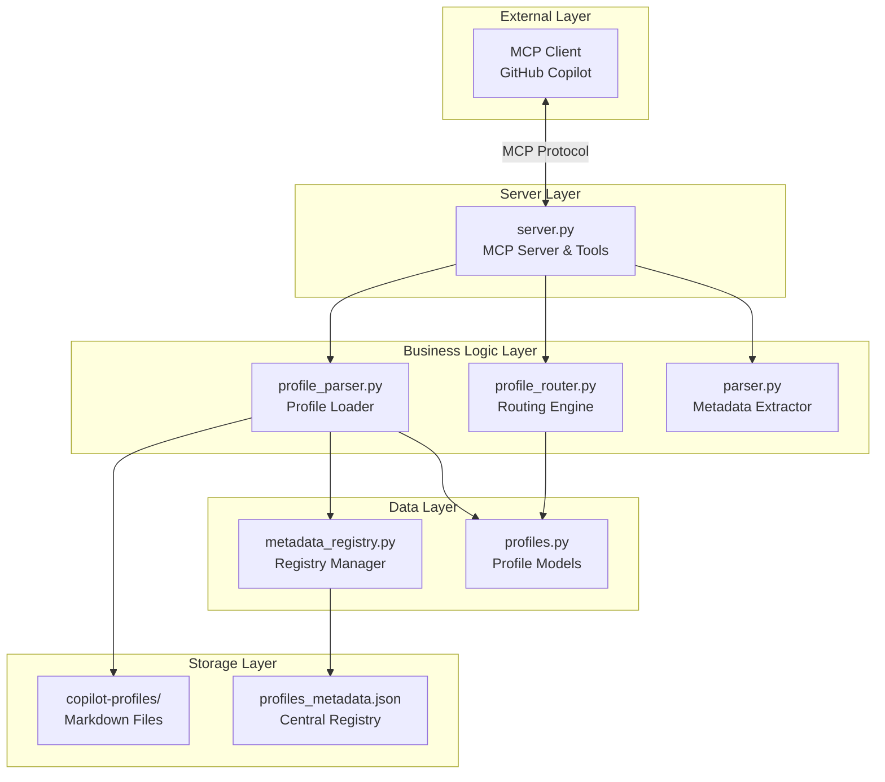
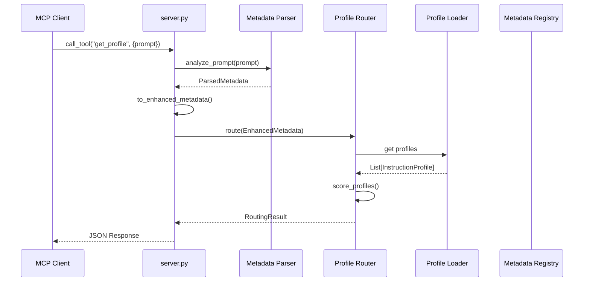
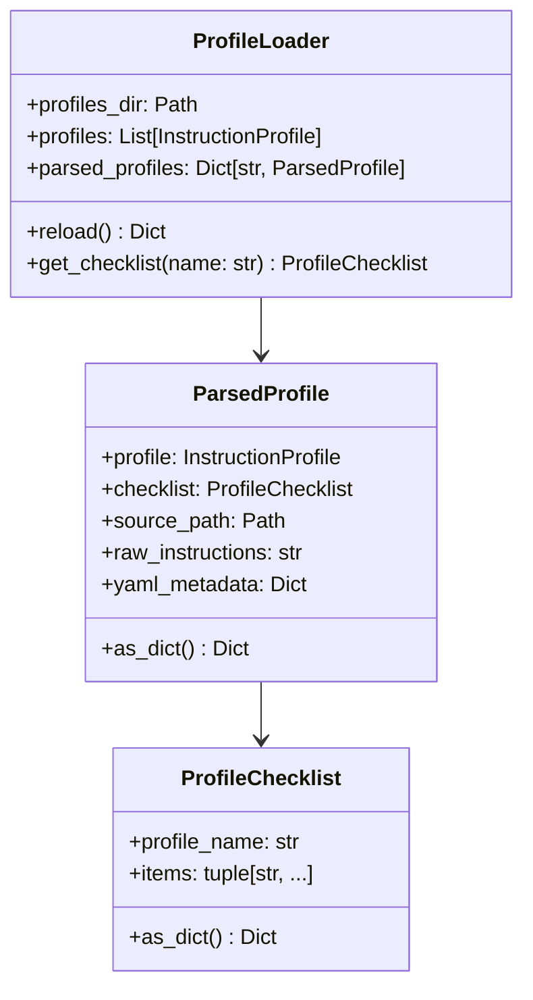
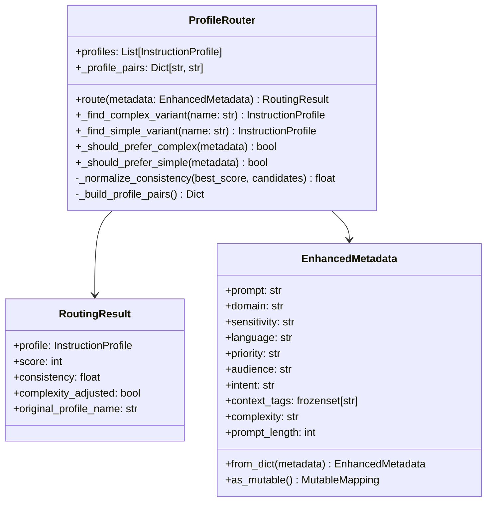
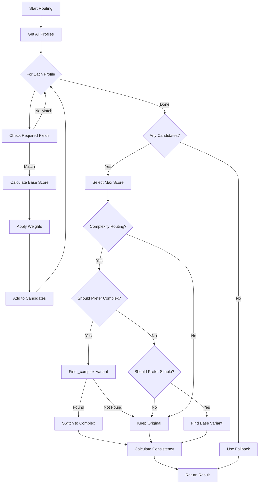
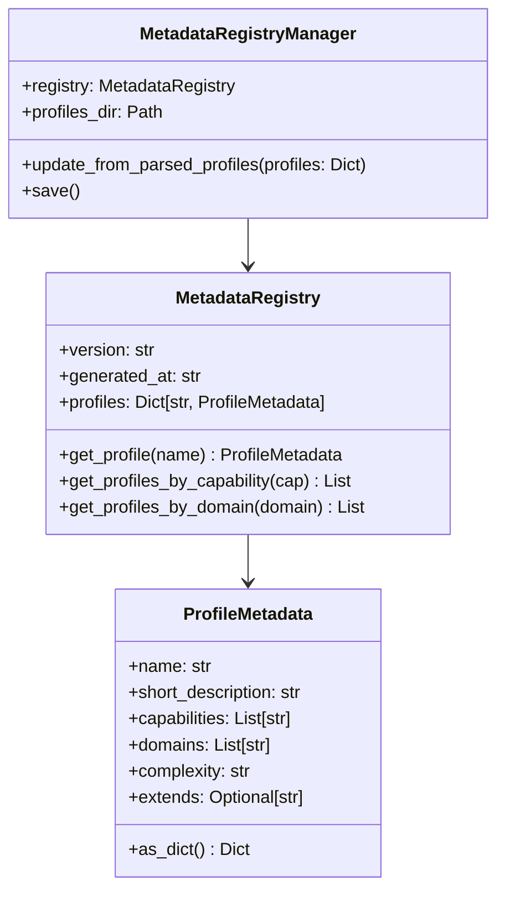
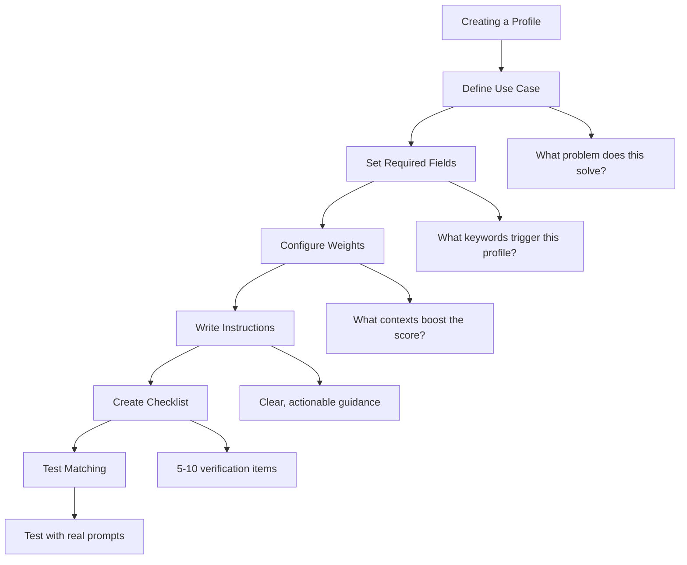

# MCP Prompt Broker - Developer Guide

[← Back to README](../README.md) | [← User Guide](USER_GUIDE.md) | [Reports →](REPORTS_INDEX.md)

---

## Table of Contents

1. [Architecture Overview](#architecture-overview)
2. [Core Components](#core-components)
3. [API Reference](#api-reference)
4. [Creating Custom Profiles](#creating-custom-profiles)
5. [Metadata System](#metadata-system)
6. [Testing](#testing)
7. [Contributing](#contributing)
8. [Code Style](#code-style)

---

## Architecture Overview

MCP Prompt Broker follows a modular, layered architecture designed for extensibility and maintainability.

### High-Level Architecture



### Request Flow



### Directory Structure

```
src/mcp_prompt_broker/
├── __init__.py              # Package initialization
├── __main__.py              # Entry point for `python -m`
├── server.py                # MCP server and tool definitions
├── profile_parser.py        # Markdown profile parsing & hot reload
├── metadata_registry.py     # Central metadata management
├── instructions.py          # Legacy instruction handling
│
├── config/
│   ├── __init__.py
│   └── profiles.py          # InstructionProfile dataclass
│
├── metadata/
│   ├── __init__.py
│   └── parser.py            # Prompt analysis & metadata extraction
│
├── router/
│   ├── __init__.py
│   └── profile_router.py    # Profile matching & scoring logic
│
└── copilot-profiles/        # Markdown profile files
    ├── creative_brainstorm.md
    ├── creative_brainstorm_complex.md
    ├── general_default.md
    ├── general_default_complex.md
    ├── privacy_sensitive.md
    ├── privacy_sensitive_complex.md
    ├── technical_support.md
    ├── technical_support_complex.md
    └── profiles_metadata.json
```

---

## Core Components

### 1. MCP Server (`server.py`)

The main entry point that handles MCP protocol communication and tool dispatch.

**Key Responsibilities:**
- Initialize MCP server with stdio transport
- Register and handle MCP tools
- Coordinate between parser, router, and loader

**Key Classes/Functions:**

```python
def _build_server(loader: ProfileLoader) -> Server:
    """Build and configure the MCP server with tools."""

async def _run_server(server: Server) -> None:
    """Run the MCP server using stdio transport."""

def run(argv: List[str] | None = None) -> int:
    """Parse arguments and run the MCP prompt broker server."""
```

### 2. Profile Parser (`profile_parser.py`)

Handles parsing of markdown profiles with YAML frontmatter.



**Key Functions:**

```python
def _parse_yaml_frontmatter(content: str) -> tuple[Dict, str]:
    """Extract YAML frontmatter and remaining content."""

def _extract_section(content: str, header: str) -> Optional[str]:
    """Extract content under a specific markdown header."""

def _extract_checklist_items(content: str) -> List[str]:
    """Extract checklist items from markdown content."""
```

### 3. Profile Router (`router/profile_router.py`)

Implements the routing logic for matching prompts to profiles.



**Scoring Algorithm with Complexity Routing:**



### 3.1 Complexity Configuration (`router/complexity_config.py`)

Configuration module for complexity-based profile routing.

| Constant | Description | Default |
|----------|-------------|---------|
| `COMPLEXITY_ROUTING_ENABLED` | Feature toggle | `true` |
| `COMPLEX_SUFFIX` | Suffix for complex variants | `_complex` |
| `WORD_COUNT_PREFER_COMPLEX_THRESHOLD` | Words to prefer complex | `60` |
| `COMPLEX_VARIANT_MIN_SCORE_RATIO` | Min score ratio for switch | `0.8` |

### 4. Metadata Parser (`metadata/parser.py`)

Extracts metadata from user prompts using keyword matching.

**Key Data Structures:**

```python
INTENT_KEYWORDS = {
    "bug_report": ("bug", "stack trace", "exception", "error"),
    "brainstorm": ("brainstorm", "ideas", "ideation", "creative"),
    "diagnosis": ("investigate", "diagnose", "root cause"),
    # ...
}

DOMAIN_KEYWORDS = {
    "healthcare": ("patient", "medical", "clinic", "hospital"),
    "finance": ("payment", "invoice", "credit", "bank"),
    # ...
}
```

### 5. Metadata Registry (`metadata_registry.py`)

Manages the central metadata registry that tracks all profile metadata.



---

## API Reference

### MCP Tools

#### `list_profiles`

Lists all available instruction profiles.

```typescript
interface ListProfilesInput {
  // No parameters required
}

interface ListProfilesOutput {
  profiles: Profile[];
}
```

#### `get_profile`

Analyzes a prompt and returns the best-matching profile.

```typescript
interface GetProfileInput {
  prompt: string;
  metadata?: {
    domain?: string;
    sensitivity?: string;
    language?: string;
    priority?: string;
    audience?: string;
    intent?: string;
    context_tags?: string[];
  };
}

interface GetProfileOutput {
  profile: Profile;
  metadata: ParsedMetadata;
  routing: {
    score: number;
    consistency: number;
  };
}
```

#### `reload_profiles`

Hot-reloads profiles from markdown files.

```typescript
interface ReloadProfilesOutput {
  status: "success" | "error";
  profiles_loaded: number;
  profile_names: string[];
  errors: string[];
  registry_updated: boolean;
}
```

#### `get_checklist`

Gets the checklist for a specific profile.

```typescript
interface GetChecklistInput {
  profile_name: string;
}

interface GetChecklistOutput {
  profile_name: string;
  items: string[];
  count: number;
}
```

#### `get_registry_summary`

Gets summary statistics from the metadata registry.

```typescript
interface RegistrySummaryOutput {
  version: string;
  total_profiles: number;
  by_complexity: { standard: number; complex: number };
  capabilities: string[];
  domains: string[];
}
```

#### `find_profiles_by_capability`

Finds profiles with a specific capability.

```typescript
interface FindByCapabilityInput {
  capability: string;
}

interface FindByCapabilityOutput {
  capability: string;
  matches_count: number;
  profiles: ProfileSummary[];
}
```

#### `find_profiles_by_domain`

Finds profiles matching a specific domain.

```typescript
interface FindByDomainInput {
  domain: string;
}

interface FindByDomainOutput {
  domain: string;
  matches_count: number;
  profiles: ProfileSummary[];
}
```

### Internal Python API

#### InstructionProfile

```python
@dataclass(frozen=True)
class InstructionProfile:
    name: str
    instructions: str
    required: Mapping[str, frozenset[str]]
    weights: Mapping[str, Mapping[str, int]]
    default_score: int = 0
    fallback: bool = False
    
    def is_match(self, metadata: Mapping) -> bool:
        """Check if metadata matches required fields."""
    
    def score(self, metadata: Mapping) -> int:
        """Calculate weighted score for metadata."""
```

#### ParsedMetadata

```python
@dataclass(frozen=True)
class ParsedMetadata:
    prompt: str
    intent: str
    domain: str | None
    topics: frozenset[str]
    sensitivity: str = "low"
    safety_score: int = 0
    tone: str = "neutral"
    complexity: str = "low"
    
    def to_enhanced_metadata(
        self, 
        overrides: Mapping | None = None
    ) -> EnhancedMetadata:
        """Convert to EnhancedMetadata with optional overrides."""
```

---

## Creating Custom Profiles

### Profile Format

Profiles are markdown files with YAML frontmatter:

```markdown
---
name: my_custom_profile
short_description: Brief description for the registry
default_score: 3
fallback: false
extends: base_profile_name  # Optional

required:
  intent:
    - keyword1
    - keyword2
  domain:
    - domain1

weights:
  audience:
    marketing: 2
    engineering: 1
  context_tags:
    tag1: 2
    tag2: 1
---

## Instructions

Your instruction content here...

### Section 1

Details...

### Section 2

More details...

## Checklist

- [ ] Item 1
- [ ] Item 2
- [ ] Item 3
```

### YAML Frontmatter Fields

| Field | Type | Required | Description |
|-------|------|----------|-------------|
| `name` | string | Yes | Unique profile identifier |
| `short_description` | string | No | Brief description for registry |
| `default_score` | int | Yes | Base score when matched |
| `fallback` | bool | No | Use as fallback when no match |
| `extends` | string | No | Name of profile this extends |
| `required` | object | No | Required metadata values for matching |
| `weights` | object | No | Score weights for metadata values |

### Best Practices for Profiles



1. **Clear Naming**: Use descriptive names like `privacy_healthcare` or `creative_marketing`
2. **Focused Instructions**: Keep instructions under 2000 tokens for efficiency
3. **Actionable Checklists**: Make checklist items verifiable
4. **Specific Keywords**: Use domain-specific terms in `required` fields
5. **Balanced Weights**: Don't over-weight single attributes

### Complex Profile Guidelines

For `*_complex` profiles:

1. **Extend Base Profile**: Always use `extends` to reference standard profile
2. **Add Meta-Cognition**: Include self-reflection prompts
3. **Chain-of-Thought**: Provide structured reasoning frameworks
4. **Higher Default Score**: Set `default_score` higher than base profile

### Keyword Inheritance via `extends`

When a profile uses `extends`, it automatically inherits `weights.keywords` from the parent profile:

```yaml
---
name: my_profile_complex
extends: my_profile  # Inherits keywords from my_profile
weights:
  keywords:
    # These keywords are ADDED to parent keywords
    complex: 15
    enterprise: 12
    # Child keywords override parent if same key exists
---
```

**How it works:**

1. Parent profile's `weights.keywords` are loaded first
2. Child profile's `weights.keywords` are merged on top
3. If the same keyword exists in both, child value takes precedence
4. The merged weights are used for scoring

**Example:**

```
Parent (my_profile):
  weights.keywords: {python: 10, code: 8}

Child (my_profile_complex):
  weights.keywords: {python: 15, complex: 12}

Merged result:
  weights.keywords: {python: 15, code: 8, complex: 12}
                     ↑ child     ↑ inherited  ↑ child
                     overrides
```

**Multi-level inheritance:**

Extends chains are resolved in topological order (parents first):

```
A (base) → B (extends A) → C (extends B)

C inherits from B, which already includes A's keywords.
```

---

## Metadata System

### Automatic Capability Inference

The registry infers capabilities from profile content:

```python
CAPABILITY_KEYWORDS = {
    "ideation": ("brainstorm", "ideation", "creative", "ideas"),
    "chain_of_thought": ("chain-of-thought", "step by step", "reasoning"),
    "privacy_protection": ("privacy", "redact", "pii", "sensitive"),
    "troubleshooting": ("troubleshoot", "diagnos", "debug", "root cause"),
    # ...
}
```

### Automatic Domain Inference

Domains are inferred from profile content:

```python
DOMAIN_KEYWORDS = {
    "healthcare": ("healthcare", "medical", "patient", "hipaa"),
    "finance": ("finance", "payment", "credit", "pci", "banking"),
    "engineering": ("engineering", "code", "debug", "deploy", "api"),
    "creative": ("creative", "brainstorm", "design", "innovation"),
    # ...
}
```

### Registry File Structure

The `profiles_metadata.json` file:

```json
{
  "version": "1.0",
  "generated_at": "2025-12-06T16:38:54.822869+00:00",
  "profiles": {
    "creative_brainstorm": {
      "name": "creative_brainstorm",
      "short_description": "Encourage creative exploration...",
      "capabilities": ["ideation", "divergent_thinking", "..."],
      "domains": ["creative", "engineering"],
      "complexity": "standard",
      "extends": null,
      "checklist_count": 8,
      "instructions_length": 1860
    }
  },
  "summary": {
    "total_profiles": 8,
    "by_complexity": { "standard": 4, "complex": 4 },
    "all_capabilities": ["..."],
    "all_domains": ["..."]
  }
}
```

---

## Testing

### Running Tests

```bash
# Install dev dependencies
pip install -e ".[dev]"

# Run all tests
pytest

# Run with coverage
pytest --cov=mcp_prompt_broker

# Run specific test file
pytest tests/test_profile_router.py
```

### Test Structure

```
tests/
├── test_metadata_parser.py    # Tests for prompt analysis
├── test_profile_parser.py     # Tests for markdown parsing
└── test_profile_router.py     # Tests for routing logic
```

### Writing Tests

```python
import pytest
from mcp_prompt_broker.router.profile_router import ProfileRouter, EnhancedMetadata

def test_route_creative_prompt():
    router = ProfileRouter()
    metadata = EnhancedMetadata(
        prompt="Help me brainstorm ideas",
        intent="brainstorm",
        domain="creative"
    )
    result = router.route(metadata)
    assert "creative" in result.profile.name.lower()
    assert result.score > 0
```

---

## Contributing

### Development Setup

```bash
# Clone repository
git clone https://github.com/michaelprinc/MCP_prompt_broker.git
cd MCP_prompt_broker

# Create virtual environment
python -m venv .venv
source .venv/bin/activate  # or .venv\Scripts\activate on Windows

# Install in development mode
pip install -e ".[dev]"

# Run tests to verify setup
pytest
```

### Contribution Workflow


1. **Fork** the repository
2. **Create** a feature branch: `git checkout -b feature/my-feature`
3. **Make** your changes with tests
4. **Run** linting and tests: `pytest && flake8`
5. **Commit** with clear message: `git commit -m "Add: feature description"`
6. **Push** to your fork: `git push origin feature/my-feature`
7. **Open** a Pull Request

### Commit Message Format

```
<type>: <description>

[optional body]

[optional footer]
```

Types: `Add`, `Fix`, `Update`, `Remove`, `Refactor`, `Docs`, `Test`

---

## Code Style

### Python Style Guide

- Follow PEP 8
- Use type hints for all functions
- Maximum line length: 100 characters
- Use dataclasses for data structures
- Prefer `from __future__ import annotations` for forward references

### Documentation Style

- Use docstrings for all public functions/classes
- Follow Google style docstrings
- Include type information in docstrings

```python
def analyze_prompt(prompt: str) -> ParsedMetadata:
    """Analyze a prompt and extract metadata.
    
    Args:
        prompt: The user's input prompt to analyze.
        
    Returns:
        ParsedMetadata containing extracted intent, domain, and topics.
        
    Raises:
        ValueError: If prompt is empty.
    """
```

### File Organization

- One class per file when class is complex
- Group related utilities in single modules
- Use `__init__.py` for public exports

---

## Appendix: Architecture Decision Records

For detailed architecture decisions and implementation history, see the [Reports Index](REPORTS_INDEX.md).

Key decisions documented:
- MCP API compatibility updates
- Package structure changes
- Import path corrections
- Hot reload implementation
- Complex profiles and metadata registry

---

[← Back to README](../README.md) | [← User Guide](USER_GUIDE.md) | [Reports →](REPORTS_INDEX.md)
