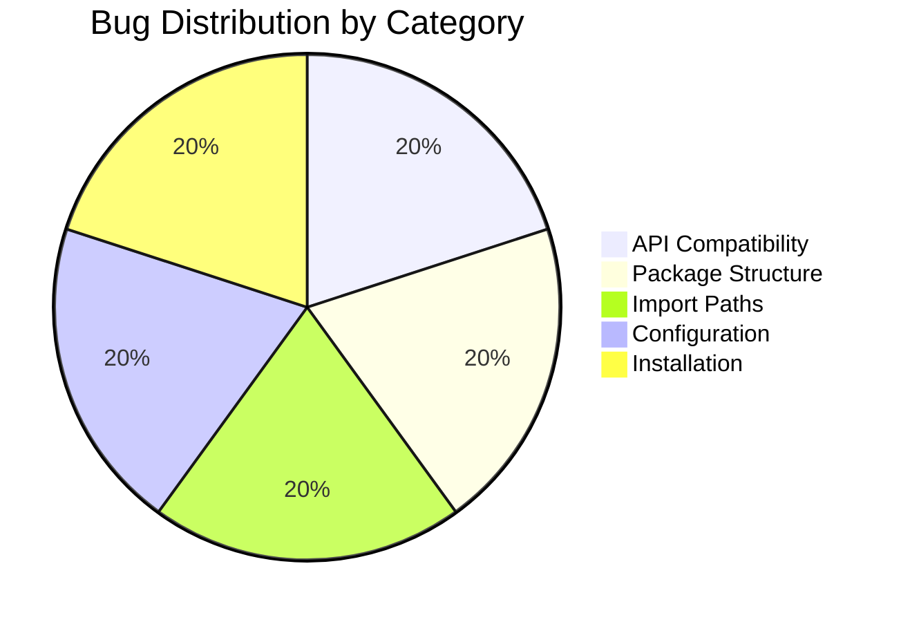
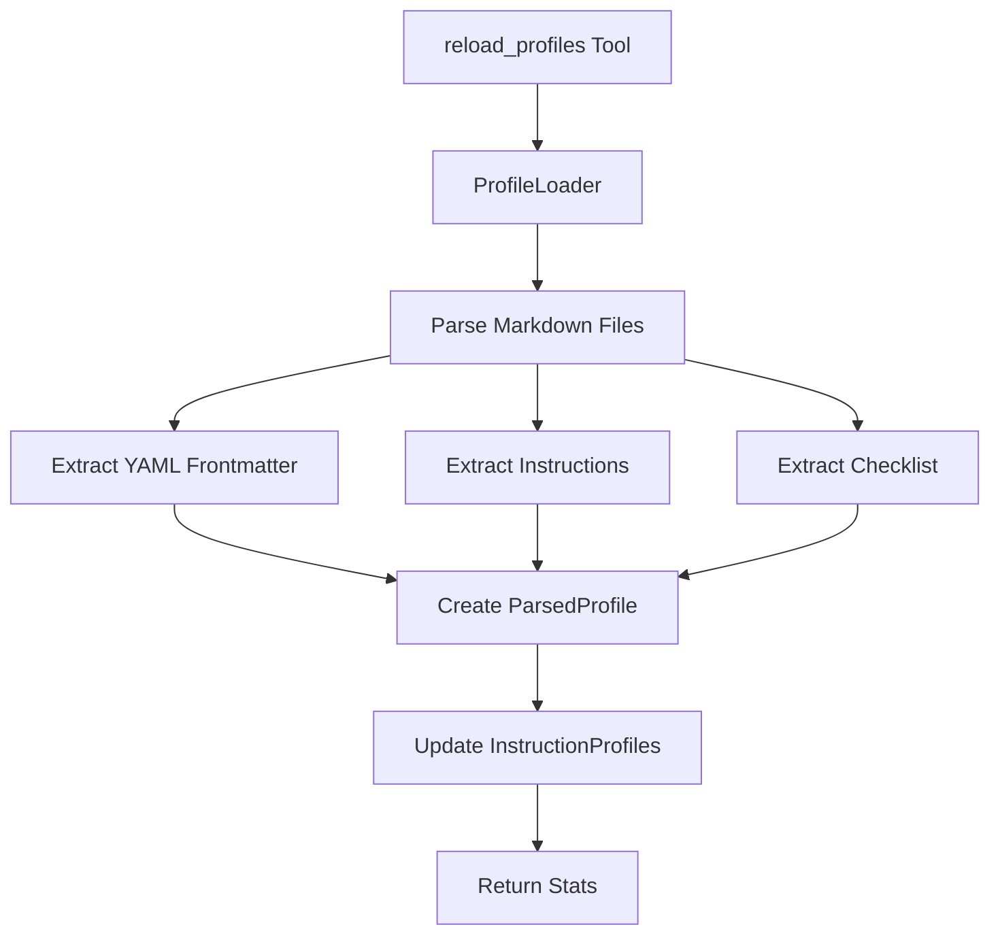
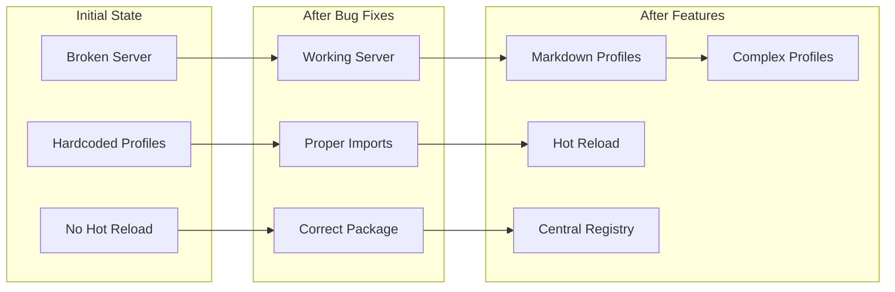

# MCP Prompt Broker - Reports Index

[← Back to README](../README.md) | [← User Guide](USER_GUIDE.md) | [← Developer Guide](DEVELOPER_GUIDE.md)

---

## Overview

This document provides an index to the ad-hoc development reports created during the MCP Prompt Broker project. These reports document implementation decisions, bug fixes, and feature development history.

> **Note**: Reports are written in Czech as they document the original development process. They serve as Architecture Decision Records (ADRs) and implementation documentation.

---

## Report Timeline

```mermaid
timeline
    title MCP Prompt Broker Development Timeline
    section Phase 1: Bug Fixes
        Dec 4, 2025 : Error Analysis (01)
                    : MCP Server API Fix (02)
                    : Import Path Fixes (03)
                    : pyproject.toml Fix (04)
                    : install.ps1 Fix (05)
    section Phase 2: VS Code Integration
        Dec 6, 2025 : VS Code Config Plan (06)
    section Phase 3: New Features
        Dec 6, 2025 : Hot Reload (07)
                    : Complex Profiles (08)
    section Phase 4: Testing & Validation
        Dec 25, 2025 : Companion Agent (09)
                     : Registry Refactoring (10)
                     : Codex CLI Analysis (11)
```

---

## Reports by Category

### 🐛 Bug Fixes & Critical Issues

| # | Report | Description | Priority | Status |
|---|--------|-------------|----------|--------|
| 01 | [Error Overview](../reports/01_prehled_chyb.md) | Comprehensive analysis of 5 critical bugs preventing server startup | Critical | ✅ Resolved |
| 02 | [MCP Server API Fix](../reports/02_oprava_mcp_server.md) | Migration from deprecated `run_stdio()` to new MCP 1.23.1 API | Critical | ✅ Resolved |
| 03 | [Import Path Fixes](../reports/03_oprava_importu.md) | Conversion from absolute to relative imports for package compatibility | Critical | ✅ Resolved |
| 04 | [pyproject.toml Fix](../reports/04_oprava_pyproject.md) | Package configuration for proper src layout discovery | Critical | ✅ Resolved |
| 05 | [install.ps1 Fix](../reports/05_oprava_install_ps1.md) | Enhanced installation script with validation and error handling | Medium | ✅ Resolved |

### ⚙️ Configuration & Integration

| # | Report | Description | Priority | Status |
|---|--------|-------------|----------|--------|
| 06 | [VS Code Integration Plan](../reports/06_implementacni_plan_vscode.md) | Plan for `.vscode/mcp.json` auto-configuration | Medium | ✅ Implemented |

### ✨ Feature Development

| # | Report | Description | Priority | Status |
|---|--------|-------------|----------|--------|
| 07 | [Hot Reload Implementation](../reports/07_hot_reload_profiles.md) | Markdown profile parser and hot reload functionality | High | ✅ Implemented |
| 08 | [Complex Profiles & Registry](../reports/08_complex_profiles_centralni_metadata.md) | Advanced profiles with meta-cognition and central metadata | High | ✅ Implemented |
| 09 | [Companion Agent Implementation](../reports/09_companion_agent_implementation.md) | Companion agent integration and configuration | Medium | ✅ Implemented |
| 10 | [Registry Refactoring Evaluation](../reports/10_registry_refactoring_evaluation.md) | Evaluation of metadata registry refactoring | Medium | ✅ Completed |
| 11 | [Codex CLI Routing Analysis](../reports/11_codex_cli_profile_routing_analysis.md) | Deep analysis of Codex CLI profile routing failure | Critical | ✅ Analyzed |
| 22 | [Complexity-Based Routing Plan](../reports/22_complexity_routing_implementation_plan.md) | Implementation plan for automatic _complex profile preference | High | 🚧 Planning |

### 📋 Implementation Checklists

| # | Report | Description | Priority | Status |
|---|--------|-------------|----------|--------|
| 22 | [Complexity Routing Checklist](../reports/22_complexity_routing_checklist.md) | Detailed checklist for complexity-based routing implementation | High | 🚧 In Progress |

---

## Report Summaries

### Report 01: Error Overview (Přehled chyb)

**Purpose**: Initial analysis identifying all blocking issues preventing server operation.

**Key Findings**:
- 5 critical bugs identified
- MCP API incompatibility with version 1.23.1
- Package structure issues in pyproject.toml
- Import path problems (absolute vs relative)
- Installation script deficiencies



---

### Report 02: MCP Server API Fix

**Purpose**: Update server implementation to use current MCP library API.

**Key Changes**:
```python
# Before (broken)
asyncio.run(server.run_stdio())

# After (working)
async with mcp.server.stdio.stdio_server() as (read_stream, write_stream):
    await server.run(read_stream, write_stream, InitializationOptions(...))
```

**Impact**: Server can now start and communicate via MCP protocol.

---

### Report 03: Import Path Fixes

**Purpose**: Fix module imports to work both in development and after package installation.

**Key Changes**:
```python
# Before (broken after install)
from config.profiles import InstructionProfile

# After (works everywhere)
from .config.profiles import InstructionProfile
```

**Files Modified**: 
- `server.py`
- `metadata/parser.py`
- `router/profile_router.py`

---

### Report 04: pyproject.toml Fix

**Purpose**: Configure setuptools to properly discover all packages in src layout.

**Key Changes**:
```toml
[tool.setuptools]
package-dir = { "" = "src" }

[tool.setuptools.packages.find]
where = ["src"]
include = ["mcp_prompt_broker*"]
```

**Impact**: All subpackages now included in distribution.

---

### Report 05: install.ps1 Fix

**Purpose**: Improve installation script reliability and validation.

**Key Improvements**:
- Exit code validation
- Installation verification
- Server startup test
- Better error messages
- Dev dependencies support

---

### Report 06: VS Code Integration Plan

**Purpose**: Plan automatic `.vscode/mcp.json` configuration during install.

**Key Features**:
- Automatic directory creation
- Configuration merge (preserve existing)
- Cross-platform path handling
- Workspace-relative paths using `${workspaceFolder}`

---

### Report 07: Hot Reload Implementation

**Purpose**: Enable runtime profile updates without server restart.

**Architecture**:



**New Components**:
- `ProfileLoader` class
- `ProfileChecklist` dataclass
- `ParsedProfile` dataclass
- YAML frontmatter parser
- Checklist extractor

---

### Report 08: Complex Profiles & Central Registry

**Purpose**: Add advanced profiles with meta-cognition and centralized metadata management.

**New Profiles**:
| Profile | Key Features |
|---------|--------------|
| `creative_brainstorm_complex` | SCAMPER-X, chain-of-thought, perspective rotation |
| `technical_support_complex` | Root cause framework, escalation patterns |
| `privacy_sensitive_complex` | Zero-trust, adversarial awareness, compliance matrix |
| `general_default_complex` | Adaptive reasoning, multi-step verification |

**New Components**:
- `MetadataRegistryManager` - Central registry management
- `ProfileMetadata` - Rich metadata per profile
- Automatic capability inference
- Automatic domain detection
- `profiles_metadata.json` - Central registry file

---

### Report 09: Companion Agent Implementation

**Purpose**: Integrate companion agent for enhanced user interaction.

**Key Features**:
- Companion agent configuration in `companion-agent.json`
- Custom instructions for MCP Prompt Broker context
- Integration with existing profiles

**Impact**: Enhanced user experience with specialized agent support.

---

### Report 10: Registry Refactoring Evaluation

**Purpose**: Evaluate metadata registry architecture and identify improvements.

**Key Findings**:
- Central registry provides good abstraction
- Automatic inference working well
- Some profiles missing metadata
- Hot reload consistency validated

**Recommendations**: Continue with current architecture, add validation.

---

### Report 11: Codex CLI Routing Analysis ⭐ NEW

**Purpose**: Deep analysis of why Codex CLI profile wasn't recognized.

**Root Causes Identified**:
1. ❌ **Missing `## Instructions` section** - Profile not loaded at all
2. ❌ **Keywords not in metadata parser** - "Codex CLI" not recognized
3. ❌ **Silent hot reload failure** - No warning to user
4. ❌ **Capabilities matching failed** - Even if loaded, wouldn't match

**Key Findings**:

```python
# Parser didn't know about Codex CLI
INTENT_KEYWORDS = {
    # "code_generation": ("codex", "codex cli") ❌ MISSING
}

# Profile had wrong structure
## Primary Role  ❌ Should be ## Instructions
```

**Solutions Implemented**:
- ✅ Created comprehensive testing profile
- ✅ Built automated validation suite
- ✅ Documented all issues with implementation plan

**New Artifacts**:11 |
| Bug Fix Reports | 5 |
| Feature Reports | 3 |
| Analysis Reports | 2 |
| Planning Reports | 1 |
| Total Lines (est.) | ~4,000 |
| Language | Czech + Englismatic approach to preventing similar issues in future.

---

## Architecture Evolution



---

## Lessons Learned

### Technical Lessons

1. **API Versioning**: Always verify library API compatibility before upgrading
2. **Package Structure**: Use relative imports for intra-package references
3. **Testing**: Validate installation in clean environment, not just development

### Process Lessons

1. **Documentation**: Document decisions as you make them (ADRs)
2. **Incremental Fixes**: Address issues one at a time with verification
3. **Validation Scripts**: Automate installation testing

---

## Report Statistics

| Metric | Value |
|--------|-------|
| Total Reports | 8 |
| Bug Fix Reports | 5 |
| Feature Reports | 2 |
| Planning Reports | 1 |
| Total Lines (est.) | ~2,000 |
| Language | Czech |

---

## Contributing to Reports

When creating new reports, follow this template:

```markdown
# Report Title

**Date:** YYYY-MM-DD  
**Author:** Name  
**Priority:** Critical | High | Medium | Low  

---

## Objective

What problem are we solving?

## Analysis

What did we find?

## Solution

What changes were made?

## Verification

How do we know it works?

## Next Steps

What remains to be done?
```

---

## See Also

- [README](../README.md) - Project overview
- [User Guide](USER_GUIDE.md) - Usage instructions
- [Developer Guide](DEVELOPER_GUIDE.md) - Architecture and contribution

---

[← Back to README](../README.md) | [← User Guide](USER_GUIDE.md) | [← Developer Guide](DEVELOPER_GUIDE.md)
