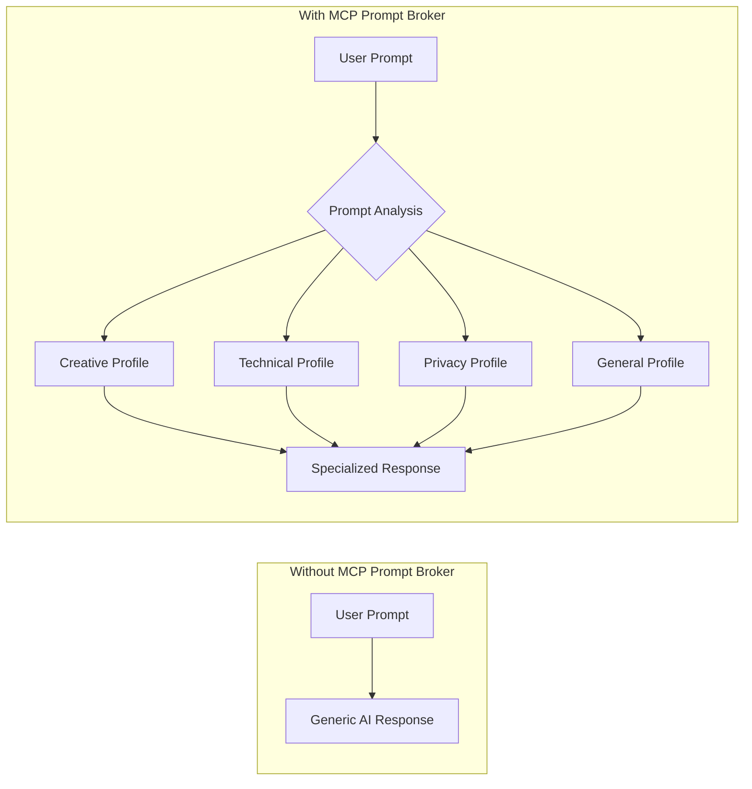
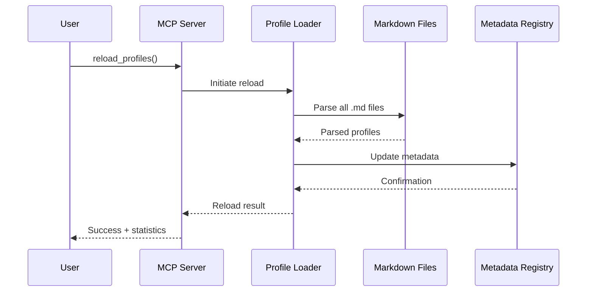
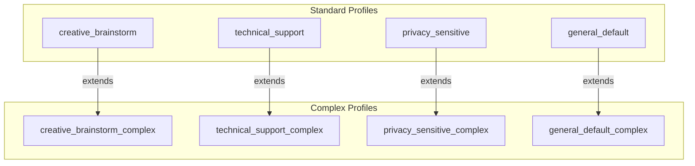
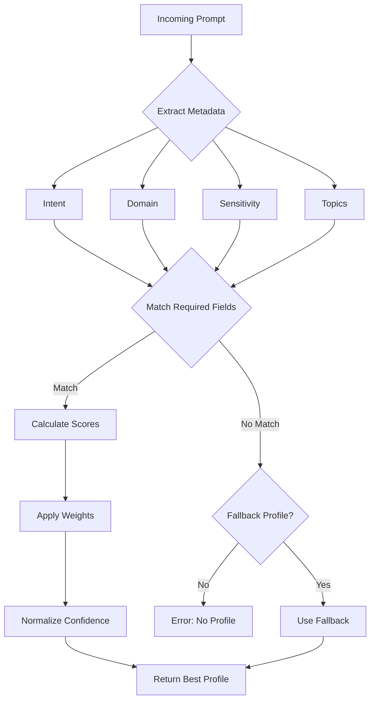

# MCP Prompt Broker - User Guide

[← Back to README](../README.md) | [Developer Guide →](DEVELOPER_GUIDE.md)

---

## Table of Contents

1. [Introduction](#introduction)
2. [Installation](#installation)
3. [Configuration](#configuration)
4. [Using the MCP Tools](#using-the-mcp-tools)
5. [Understanding Profiles](#understanding-profiles)
6. [Working with Checklists](#working-with-checklists)
7. [Troubleshooting](#troubleshooting)
8. [FAQ](#faq)

---

## Introduction

MCP Prompt Broker is an intelligent routing system that automatically selects the best instruction profile for your prompts when working with AI assistants like GitHub Copilot. Instead of using generic instructions, the broker analyzes your prompt and applies specialized guidance tailored to your task.

### What Problems Does It Solve?



### Key Benefits

| Benefit | Description |
|---------|-------------|
| **Context-Aware** | Automatically detects intent, domain, and sensitivity |
| **Specialized Guidance** | Different profiles for creative, technical, and privacy tasks |
| **Quality Assurance** | Built-in checklists ensure response quality |
| **Hot Reload** | Update profiles without restarting the server |
| **Transparent** | See why a profile was selected with scoring metrics |

---

## Installation

### System Requirements

- **Python**: 3.10 or higher
- **Operating System**: Windows, macOS, or Linux
- **Optional**: VS Code with GitHub Copilot Chat extension

### Method 1: Automated Installation (Windows)

The easiest way to install on Windows is using the provided PowerShell script:

```powershell
# Clone the repository
git clone https://github.com/michaelprinc/MCP_prompt_broker.git
cd MCP_prompt_broker

# Run the installation script
./install.ps1
```

The script will:
1. Create a Python virtual environment
2. Install the package and dependencies
3. Register the MCP server with VS Code Copilot Chat

### Method 2: Manual Installation

```bash
# Clone the repository
git clone https://github.com/michaelprinc/MCP_prompt_broker.git
cd MCP_prompt_broker

# Create virtual environment (recommended)
python -m venv .venv

# Activate virtual environment
# On Windows:
.venv\Scripts\activate
# On macOS/Linux:
source .venv/bin/activate

# Install the package
pip install .
```

### Method 3: Development Installation

For development with editable mode:

```bash
pip install -e ".[dev]"
```

### Verifying Installation

```bash
# Run the server to verify installation
python -m mcp_prompt_broker

# You should see:
# Loaded X profiles: creative_brainstorm, general_default, ...
```

---

## Configuration

### Running the Server

**Basic usage:**

```bash
python -m mcp_prompt_broker
```

**With custom profiles directory:**

```bash
python -m mcp_prompt_broker --profiles-dir /path/to/your/profiles
```

### VS Code Integration

To use MCP Prompt Broker with GitHub Copilot Chat in VS Code:

1. **Locate the MCP configuration file:**
   ```
   %APPDATA%\Code\User\globalStorage\github.copilot-chat\mcpServers.json
   ```

2. **Add the server configuration:**
   ```json
   {
     "mcp-prompt-broker": {
       "command": "python",
       "args": ["-m", "mcp_prompt_broker"],
       "cwd": "C:/path/to/MCP_prompt_broker"
     }
   }
   ```

3. **Restart VS Code** to apply changes.

### Configuration Options

| Option | Description | Default |
|--------|-------------|---------|
| `--profiles-dir` | Path to custom profiles directory | Built-in profiles |

---

## Using the MCP Tools

MCP Prompt Broker exposes several tools that can be called through the MCP protocol:

### Tool: `get_profile`

Analyzes a prompt and returns the best-matching instruction profile.

**Input:**
```json
{
  "prompt": "Help me brainstorm innovative marketing ideas for a new product launch",
  "metadata": {
    "audience": "marketing",
    "priority": "high"
  }
}
```

**Output:**
```json
{
  "profile": {
    "name": "creative_brainstorm",
    "instructions": "You are in Creative Brainstorm Mode...",
    "required": { "intent": ["brainstorm", "creative", "ideation"] }
  },
  "metadata": {
    "intent": "brainstorm",
    "domain": "marketing",
    "sensitivity": "low"
  },
  "routing": {
    "score": 8,
    "consistency": 92.5
  }
}
```

### Tool: `list_profiles`

Returns all available instruction profiles.

**Input:** None required

**Output:** Array of profile objects with their configurations.

### Tool: `reload_profiles`

Hot-reloads profiles from markdown files without restarting the server.



### Tool: `get_checklist`

Retrieves the quality checklist for a specific profile.

**Input:**
```json
{
  "profile_name": "creative_brainstorm"
}
```

**Output:**
```json
{
  "profile_name": "creative_brainstorm",
  "items": [
    "Generate at least 5 distinct ideas",
    "Apply SCAMPER framework",
    "Include at least one unconventional approach",
    "..."
  ],
  "count": 8
}
```

### Tool: `get_registry_summary`

Returns statistics about the metadata registry.

**Output:**
```json
{
  "version": "1.0",
  "total_profiles": 8,
  "capabilities": ["ideation", "troubleshooting", "compliance", "..."],
  "domains": ["creative", "engineering", "healthcare", "..."]
}
```

### Tool: `find_profiles_by_capability`

Finds profiles with a specific capability.

**Input:**
```json
{
  "capability": "ideation"
}
```

### Tool: `find_profiles_by_domain`

Finds profiles matching a specific domain.

**Input:**
```json
{
  "domain": "healthcare"
}
```

---

## Understanding Profiles

### Profile Types

MCP Prompt Broker includes two types of profiles:



| Type | Use Case | Features |
|------|----------|----------|
| **Standard** | Quick, focused tasks | Core instructions, basic checklist |
| **Complex** | Deep analysis, multi-step tasks | Meta-cognition, chain-of-thought, advanced frameworks |

### Profile Selection Criteria

The router selects profiles based on:

1. **Intent Detection**: What is the user trying to do?
   - `brainstorm`, `creative`, `ideation` → Creative profiles
   - `debug`, `troubleshoot`, `diagnose` → Technical profiles
   - `privacy`, `compliance`, `sensitive` → Privacy profiles

2. **Domain Recognition**: What field/industry?
   - Healthcare, Finance, Engineering, Legal, etc.

3. **Sensitivity Assessment**: How sensitive is the content?
   - Detects PII, compliance requirements, security concerns

4. **Weighted Scoring**: Each profile has weights for:
   - Audience (marketing, engineering, executive)
   - Language preferences
   - Context tags (innovation, storytelling, compliance)

### Routing Decision Flow



---

## Working with Checklists

Each profile includes a quality checklist to ensure response quality. Use checklists to:

1. **Verify Completeness**: Ensure all aspects are addressed
2. **Quality Control**: Check response against best practices
3. **Self-Assessment**: AI uses checklist for self-reflection

### Example: Creative Brainstorm Checklist

```markdown
- [ ] Generate at least 5 distinct ideas
- [ ] Apply at least one SCAMPER technique
- [ ] Include cross-domain inspiration
- [ ] Provide one "wild card" unconventional idea
- [ ] Consider implementation feasibility
- [ ] Include next steps for best ideas
```

### Example: Privacy Sensitive Checklist

```markdown
- [ ] Identify all PII in the input
- [ ] Apply appropriate redaction
- [ ] Cite relevant regulations (GDPR, HIPAA)
- [ ] Recommend secure handling procedures
- [ ] Verify no sensitive data in output
```

---

## Troubleshooting

### Common Issues

#### Server Won't Start

**Symptom:** Error message when running `python -m mcp_prompt_broker`

**Solutions:**
1. Verify Python 3.10+ is installed: `python --version`
2. Ensure package is installed: `pip install .`
3. Check for missing dependencies: `pip install -r requirements.txt`

#### No Profiles Loaded

**Symptom:** "Warning: No profiles loaded" message

**Solutions:**
1. Check profiles directory exists
2. Verify markdown files have correct format (YAML frontmatter)
3. Run with `--profiles-dir` pointing to correct path

#### VS Code Integration Not Working

**Symptom:** Copilot Chat doesn't use MCP Prompt Broker

**Solutions:**
1. Verify `mcpServers.json` configuration
2. Restart VS Code completely
3. Check VS Code Developer Tools for errors

### Debug Mode

For detailed logging, set the environment variable:

```bash
# Windows PowerShell
$env:MCP_DEBUG = "true"
python -m mcp_prompt_broker

# macOS/Linux
MCP_DEBUG=true python -m mcp_prompt_broker
```

---

## FAQ

### Q: Can I create my own profiles?

**A:** Yes! Create a new markdown file in the profiles directory with YAML frontmatter. See [Developer Guide](DEVELOPER_GUIDE.md) for profile format.

### Q: How do I update profiles without restarting?

**A:** Use the `reload_profiles` MCP tool. It will re-parse all markdown files and update the registry.

### Q: What happens if no profile matches?

**A:** The `general_default` profile is configured as a fallback and will be used for unmatched prompts.

### Q: Can I use this with other AI assistants?

**A:** MCP Prompt Broker uses the standard Model Context Protocol, so it works with any MCP-compatible client.

### Q: How is the confidence score calculated?

**A:** The consistency score uses softmax-style normalization across all matching profiles, indicating how "confident" the router is in its selection.

---

## Next Steps

- **Developers**: See [Developer Guide](DEVELOPER_GUIDE.md) for architecture and API details
- **Reports**: See [Reports Index](REPORTS_INDEX.md) for development history
- **Issues**: Report bugs at [GitHub Issues](https://github.com/michaelprinc/MCP_prompt_broker/issues)

---

[← Back to README](../README.md) | [Developer Guide →](DEVELOPER_GUIDE.md)
