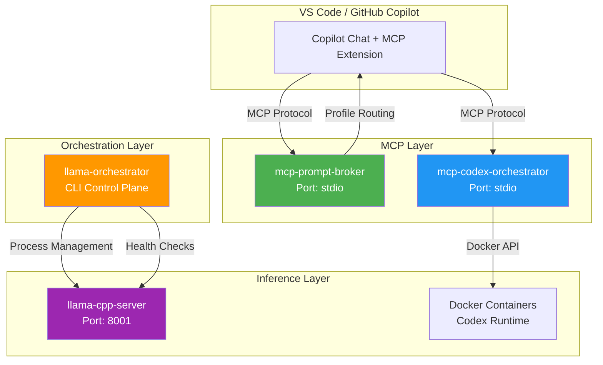
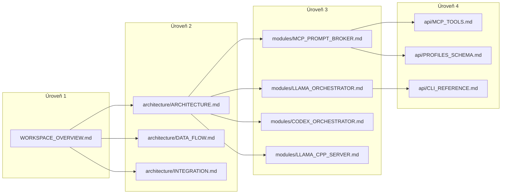

# MCP Prompt Broker Workspace - Přehled

> **Verze dokumentace:** 1.0.0  
> **Datum:** 31. prosince 2025  
> **Úroveň:** 1/4 - Executive Overview

---

## 📋 Obsah

1. [Úvod](#úvod)
2. [Přehled modulů](#přehled-modulů)
3. [Technologický stack](#technologický-stack)
4. [Architektura na vysoké úrovni](#architektura-na-vysoké-úrovni)
5. [Navigace dokumentace](#navigace-dokumentace)
6. [Quick Start](#quick-start)

---

## Úvod

**MCP Prompt Broker Workspace** je komplexní ekosystém nástrojů pro inteligentní orchestraci AI agentů a lokální LLM inference. Workspace obsahuje několik nezávislých modulů, které spolu kooperují prostřednictvím Model Context Protocol (MCP).

### Mise projektu

```
┌─────────────────────────────────────────────────────────────────────────────┐
│                         MCP PROMPT BROKER ECOSYSTEM                         │
├─────────────────────────────────────────────────────────────────────────────┤
│                                                                             │
│   🎯 MISE: Poskytovat inteligentní, kontextově-vědomé instrukce pro AI     │
│            agenty s podporou lokální inference a automatizované orchestrace │
│                                                                             │
│   📊 HODNOTA:                                                               │
│      • Dynamický výběr optimálních instrukcí pro různé úlohy               │
│      • Izolované spouštění AI úloh v Docker kontejnerech                   │
│      • Lokální LLM inference s GPU akcelerací                              │
│      • Jednotné MCP rozhraní pro VS Code Copilot                           │
│                                                                             │
└─────────────────────────────────────────────────────────────────────────────┘
```

---

## Přehled modulů

Workspace je organizován do **4 hlavních modulů** + podpůrné struktury:

| Modul | Popis | Status | Lokace |
|-------|-------|--------|--------|
| **mcp-prompt-broker** | Hlavní MCP server pro inteligentní routing promptů | ✅ Produkční | `packages/mcp-prompt-broker/` |
| **llama-orchestrator** | Docker-like CLI pro správu llama.cpp instancí | 🔧 Alpha | `packages/llama-orchestrator/` |
| **mcp-codex-orchestrator** | MCP server pro Codex CLI v Docker kontejnerech | 🔧 Alpha | `packages/mcp-codex-orchestrator/` |
| **llama-cpp-server** | Konfigurace lokálního llama.cpp serveru | ✅ Funkční | `infrastructure/llama-cpp-server/` |

### Vztahy mezi moduly



---

## Technologický stack

### Jazyky a runtime

| Technologie | Verze | Použití |
|-------------|-------|---------|
| Python | 3.10+ / 3.11+ | Všechny moduly |
| TypeScript/Node.js | 18+ | Codex CLI |
| PowerShell | 5.1+ | Instalační skripty (Windows) |

### Hlavní závislosti

| Závislost | Modul | Účel |
|-----------|-------|------|
| `mcp>=1.0.0` | prompt-broker, codex-orchestrator | Model Context Protocol |
| `pydantic>=2.0` | llama-orchestrator, codex-orchestrator | Datová validace |
| `typer>=0.9` | llama-orchestrator | CLI framework |
| `docker>=7.0` | codex-orchestrator | Container management |
| `httpx>=0.25` | llama-orchestrator | HTTP klient |
| `rich>=13.7` | llama-orchestrator | TUI Dashboard |

### Infrastruktura

| Komponenta | Technologie | Poznámka |
|------------|-------------|----------|
| Container Runtime | Docker Engine 24.0+ | Pro Codex runner |
| LLM Backend | llama.cpp + Vulkan | AMD GPU optimalizace |
| State Storage | SQLite | Llama orchestrator |
| Logging | structlog | Strukturované logy |

---

## Architektura na vysoké úrovni

```
┌─────────────────────────────────────────────────────────────────────────────┐
│                              WORKSPACE LAYOUT                               │
├─────────────────────────────────────────────────────────────────────────────┤
│                                                                             │
│  MCP_Prompt_Broker/                                                         │
│  ├── src/                          # Hlavní zdrojový kód                    │
│  │   └── mcp_prompt_broker/        # Core MCP server                        │
│  │       ├── server.py             # MCP entrypoint                         │
│  │       ├── router/               # Routing engine                         │
│  │       ├── metadata/             # Metadata extraction                    │
│  │       └── copilot-profiles/     # 45+ instrukcí profilů                  │
│  │                                                                          │
│  ├── llama-orchestrator/           # Samostatný modul                       │
│  │   └── src/llama_orchestrator/   # CLI + Daemon + TUI                     │
│  │                                                                          │
│  ├── mcp-codex-orchestrator/       # Samostatný modul                       │
│  │   └── src/mcp_codex_orchestrator/ # MCP server + Docker tools            │
│  │                                                                          │
│  ├── llama-cpp-server/             # Konfigurace inference serveru          │
│  │   ├── config.json               # Model + server nastavení               │
│  │   └── start-server.ps1          # Spouštěcí skript                       │
│  │                                                                          │
│  ├── docs/                         # Dokumentace                            │
│  │   ├── WORKSPACE_OVERVIEW.md     # ← Tento dokument (Úroveň 1)            │
│  │   ├── architecture/             # Architektonická dokumentace (Úroveň 2) │
│  │   ├── modules/                  # Modulová dokumentace (Úroveň 3)        │
│  │   └── api/                      # API reference (Úroveň 4)               │
│  │                                                                          │
│  ├── tests/                        # Testy pro všechny moduly               │
│  └── reports/                      # Implementační reporty                  │
│                                                                             │
└─────────────────────────────────────────────────────────────────────────────┘
```

---

## Navigace dokumentace

### 4-úrovňová struktura dokumentace

| Úroveň | Název | Cílová skupina | Dokumenty |
|--------|-------|----------------|-----------|
| **1** | Executive Overview | Manažeři, stakeholdeři | [WORKSPACE_OVERVIEW.md](WORKSPACE_OVERVIEW.md) |
| **2** | Architektura | Architekti, tech leads | [architecture/](architecture/) |
| **3** | Technické moduly | Vývojáři | [modules/](modules/) |
| **4** | API Reference | Vývojáři, integrátoři | [api/](api/) |

### Mapa dokumentace



---

## Quick Start

### Prerekvizity

```powershell
# Ověření prerekvizit
python --version  # >= 3.10
docker --version  # >= 24.0 (pro Codex)
node --version    # >= 18 (pro Codex CLI)
```

### Instalace celého ekosystému

```powershell
# 1. Klonování
git clone https://github.com/michaelprinc/MCP_prompt_broker.git
cd MCP_prompt_broker

# 2. Automatická instalace (Windows)
./install.ps1

# 3. Volitelné: Instalace dílčích modulů
cd llama-orchestrator && pip install -e .
cd ../mcp-codex-orchestrator && pip install -e ".[dev]"
```

### Spuštění jednotlivých komponent

| Komponenta | Příkaz | Poznámka |
|------------|--------|----------|
| MCP Prompt Broker | `python -m mcp_prompt_broker` | Automaticky via VS Code MCP |
| Llama Server | `cd llama-cpp-server && .\start-server.ps1` | Port 8001 |
| Llama Orchestrator | `llama-orch dashboard` | TUI dashboard |
| Codex Orchestrator | `python -m mcp_codex_orchestrator` | Vyžaduje Docker |

---

## Další kroky

1. **Pro architektonický přehled:** [architecture/ARCHITECTURE.md](architecture/ARCHITECTURE.md)
2. **Pro vývojáře:** [DEVELOPER_GUIDE.md](DEVELOPER_GUIDE.md)
3. **Pro uživatele:** [USER_GUIDE.md](USER_GUIDE.md)
4. **Pro API integraci:** [api/MCP_TOOLS.md](api/MCP_TOOLS.md)

---

## Kontakt a podpora

- **GitHub:** [MichaelPrinc/MCP_prompt_broker](https://github.com/michaelprinc/MCP_prompt_broker)
- **Licence:** MIT
- **Autor:** MichaelPrinc

---

*Tato dokumentace je součástí 4-úrovňové dokumentační struktury projektu MCP Prompt Broker.*
