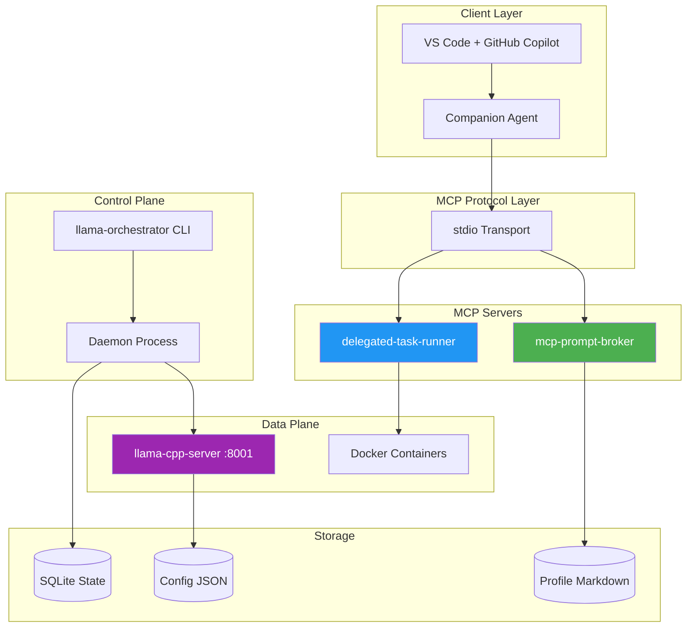
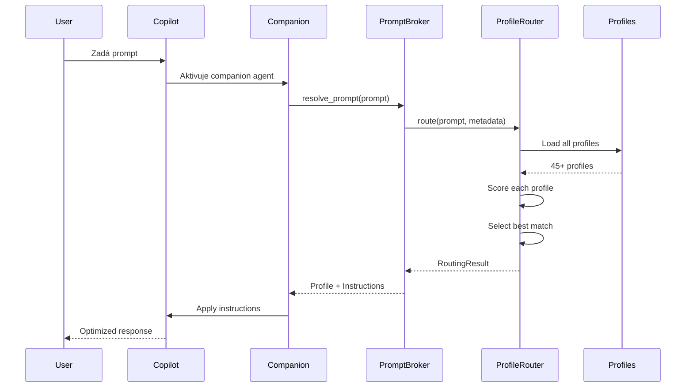
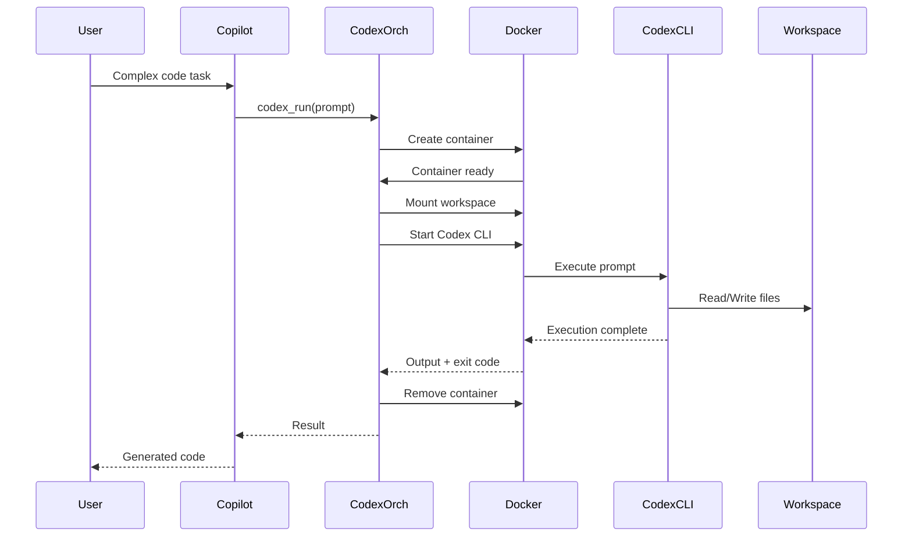

# Architektura MCP Prompt Broker Ekosystému

> **Verze dokumentace:** 1.0.0  
> **Datum:** 31. prosince 2025  
> **Úroveň:** 2/4 - Architecture Overview

---

## 📋 Obsah

1. [Architektonické principy](#architektonické-principy)
2. [Systémová architektura](#systémová-architektura)
3. [Architektura jednotlivých modulů](#architektura-jednotlivých-modulů)
4. [Datový tok](#datový-tok)
5. [Bezpečnostní architektura](#bezpečnostní-architektura)
6. [Deployment architektura](#deployment-architektura)
7. [Rozhodnutí a trade-offs](#rozhodnutí-a-trade-offs)

---

## Architektonické principy

### Základní principy

| Princip | Popis | Implementace |
|---------|-------|--------------|
| **Modularita** | Každý modul je samostatně nasaditelný | Oddělené `pyproject.toml` pro každý modul |
| **Protocol-First** | MCP jako jednotné rozhraní | Všechny moduly komunikují přes MCP |
| **Hot-Reload** | Změny bez restartu | Markdown profily + JSON registry |
| **Izolace** | Bezpečné spouštění úloh | Docker kontejnery pro Codex |
| **Lokální inference** | Nezávislost na cloudu | llama.cpp s GPU akcelerací |

### Architektonický styl

```
┌─────────────────────────────────────────────────────────────────────────────┐
│                          ARCHITEKTONICKÝ STYL                               │
├─────────────────────────────────────────────────────────────────────────────┤
│                                                                             │
│   MICROSERVICES + EVENT-DRIVEN HYBRID                                       │
│                                                                             │
│   • Moduly jsou autonomní microservices                                     │
│   • MCP protocol zajišťuje loose coupling                                   │
│   • Každý modul má vlastní lifecycle                                        │
│   • Sdílený workspace pro konfiguraci                                       │
│                                                                             │
│   Patterns:                                                                 │
│   ├── Server/Tools Pattern (MCP)                                            │
│   ├── Router/Handler Pattern (Profile routing)                              │
│   ├── Orchestrator Pattern (Llama + Codex)                                  │
│   └── Sidecar Pattern (Companion agent)                                     │
│                                                                             │
└─────────────────────────────────────────────────────────────────────────────┘
```

---

## Systémová architektura

### Vysokoúrovňový pohled



### Vrstvy architektury

| Vrstva | Komponenty | Odpovědnost |
|--------|------------|-------------|
| **Prezentační** | VS Code, Copilot Chat, TUI Dashboard | Uživatelské rozhraní |
| **Protokolová** | MCP stdio, HTTP REST | Komunikační protokoly |
| **Aplikační** | MCP servery, CLI | Business logika |
| **Orchestrační** | Daemon, Docker API | Životní cyklus procesů |
| **Datová** | SQLite, JSON, Markdown | Perzistence |
| **Infrastrukturní** | llama.cpp, Docker Engine | Runtime prostředí |

---

## Architektura jednotlivých modulů

### 1. MCP Prompt Broker

**Typ:** MCP Server  
**Transport:** stdio  
**Architektura:** Layered with Router Pattern

```
┌─────────────────────────────────────────────────────────────────┐
│                     MCP PROMPT BROKER                           │
├─────────────────────────────────────────────────────────────────┤
│                                                                 │
│  ┌─────────────┐    ┌─────────────┐    ┌─────────────┐         │
│  │   server.py │───▶│  router/    │───▶│  metadata/  │         │
│  │   (MCP API) │    │(ProfileRouter)   │  (Parser)   │         │
│  └─────────────┘    └─────────────┘    └─────────────┘         │
│         │                  │                  │                 │
│         │                  ▼                  ▼                 │
│         │           ┌─────────────┐    ┌─────────────┐         │
│         │           │profile_parser│    │metadata_    │         │
│         │           │   (.md)     │    │registry.py  │         │
│         │           └─────────────┘    └─────────────┘         │
│         │                  │                  │                 │
│         │                  ▼                  ▼                 │
│         │           ┌─────────────────────────────────┐        │
│         └──────────▶│      copilot-profiles/         │        │
│                     │  45+ Markdown instruction files │        │
│                     └─────────────────────────────────┘        │
│                                                                 │
│  MCP Tools:                                                     │
│  • resolve_prompt / get_profile                                 │
│  • list_profiles                                                │
│  • get_checklist                                                │
│  • get_profile_metadata                                         │
│  • find_profiles_by_capability                                  │
│  • find_profiles_by_domain                                      │
│  • get_registry_summary                                         │
│  • reload_profiles                                              │
│                                                                 │
└─────────────────────────────────────────────────────────────────┘
```

**Klíčové komponenty:**

| Komponenta | Soubor | Odpovědnost |
|------------|--------|-------------|
| MCP Server | `server.py` | Tool registration, request handling |
| Profile Router | `router/profile_router.py` | Scoring algorithm, profile selection |
| Metadata Parser | `metadata/parser.py` | Prompt analysis, intent detection |
| Profile Parser | `profile_parser.py` | Markdown → Python objects |
| Metadata Registry | `metadata_registry.py` | Central profile metadata store |

---

### 2. Llama Orchestrator

**Typ:** CLI Application + Daemon  
**Architektura:** Control Plane / Data Plane

```
┌─────────────────────────────────────────────────────────────────┐
│                     LLAMA ORCHESTRATOR                          │
├─────────────────────────────────────────────────────────────────┤
│                                                                 │
│  CONTROL PLANE (Python)                                         │
│  ┌─────────────┐    ┌─────────────┐    ┌─────────────┐         │
│  │    cli.py   │───▶│   daemon/   │───▶│    tui/     │         │
│  │   (Typer)   │    │ (Background)│    │   (Rich)    │         │
│  └─────────────┘    └─────────────┘    └─────────────┘         │
│         │                  │                  │                 │
│         └──────────────────┼──────────────────┘                 │
│                            ▼                                    │
│                     ┌─────────────┐                             │
│                     │   engine/   │                             │
│                     │ (Core Logic)│                             │
│                     └─────────────┘                             │
│                            │                                    │
│              ┌─────────────┼─────────────┐                      │
│              ▼             ▼             ▼                      │
│       ┌──────────┐  ┌──────────┐  ┌──────────┐                 │
│       │ health/  │  │ config/  │  │ binaries/│                 │
│       │(Monitors)│  │ (Models) │  │(Executables)              │
│       └──────────┘  └──────────┘  └──────────┘                 │
│                                                                 │
│  DATA PLANE (llama.cpp processes)                               │
│  ┌─────────────┐    ┌─────────────┐    ┌─────────────┐         │
│  │   :8001     │    │   :8002     │    │   :8003     │         │
│  │  Instance A │    │  Instance B │    │  Instance C │         │
│  └─────────────┘    └─────────────┘    └─────────────┘         │
│                                                                 │
│  CLI Commands: up, down, restart, ps, health, logs, dashboard   │
│                                                                 │
└─────────────────────────────────────────────────────────────────┘
```

**Klíčové komponenty:**

| Komponenta | Adresář | Odpovědnost |
|------------|---------|-------------|
| CLI | `cli.py` | User interface (Typer) |
| Daemon | `daemon/` | Background process management |
| Engine | `engine/` | Instance lifecycle |
| Health | `health/` | Health checks, auto-restart |
| Config | `config/` | Instance configuration models |
| Binaries | `binaries/` | llama.cpp executable management |

---

### 3. MCP Codex Orchestrator

**Typ:** MCP Server + Docker Orchestrator  
**Transport:** stdio (MCP) + Docker API  
**Architektura:** Container-per-Run Pattern

```
┌─────────────────────────────────────────────────────────────────┐
│                   MCP CODEX ORCHESTRATOR                        │
├─────────────────────────────────────────────────────────────────┤
│                                                                 │
│  ┌─────────────┐    ┌─────────────┐    ┌─────────────┐         │
│  │  server.py  │───▶│orchestrator/│───▶│   tools/    │         │
│  │  (MCP API)  │    │(Run Manager)│    │(codex_run)  │         │
│  └─────────────┘    └─────────────┘    └─────────────┘         │
│         │                  │                  │                 │
│         │                  ▼                  ▼                 │
│         │           ┌─────────────┐    ┌─────────────┐         │
│         │           │   models/   │    │   utils/    │         │
│         │           │ (Pydantic)  │    │ (Helpers)   │         │
│         │           └─────────────┘    └─────────────┘         │
│         │                                                       │
│         ▼                                                       │
│  ┌─────────────────────────────────────────────────────────────┤
│  │                    Docker Layer                              │
│  │  ┌─────────────┐    ┌─────────────┐    ┌─────────────┐      │
│  │  │ codex-runner│    │ codex-runner│    │ codex-runner│      │
│  │  │  (Run #1)   │    │  (Run #2)   │    │  (Run #3)   │      │
│  │  └─────────────┘    └─────────────┘    └─────────────┘      │
│  │         │                  │                  │              │
│  │         └──────────────────┼──────────────────┘              │
│  │                            ▼                                 │
│  │                     ┌─────────────┐                          │
│  │                     │  workspace/ │                          │
│  │                     │  (Mounted)  │                          │
│  │                     └─────────────┘                          │
│  └─────────────────────────────────────────────────────────────┤
│                                                                 │
│  MCP Tools:                                                     │
│  • codex_run - Spustí Codex CLI úlohu v kontejneru             │
│                                                                 │
└─────────────────────────────────────────────────────────────────┘
```

**Klíčové komponenty:**

| Komponenta | Adresář | Odpovědnost |
|------------|---------|-------------|
| MCP Server | `server.py` | Tool registration |
| Orchestrator | `orchestrator/` | Container lifecycle |
| Tools | `tools/` | `codex_run` implementation |
| Models | `models/` | Pydantic schemas |
| Utils | `utils/` | Logging, helpers |
| Docker | `docker/` | Dockerfile, compose |

---

### 4. Llama CPP Server

**Typ:** Inference Server  
**Backend:** llama.cpp + Vulkan  
**Architektura:** Konfigurační wrapper

```
┌─────────────────────────────────────────────────────────────────┐
│                     LLAMA CPP SERVER                            │
├─────────────────────────────────────────────────────────────────┤
│                                                                 │
│  ┌─────────────────────────────────────────────────────────────┤
│  │  config.json                                                 │
│  │  ├── server.host: 127.0.0.1                                  │
│  │  ├── server.port: 8001                                       │
│  │  ├── model.path: ../models/gpt-oss-20b-Q4_K_S.gguf          │
│  │  ├── model.context_size: 4096                                │
│  │  └── model.gpu_layers: 0                                     │
│  └─────────────────────────────────────────────────────────────┤
│                            │                                    │
│                            ▼                                    │
│  ┌─────────────────────────────────────────────────────────────┤
│  │  start-server.ps1                                            │
│  │  • Downloads llama.cpp if needed                             │
│  │  • Configures Vulkan backend                                 │
│  │  • Starts llama-server.exe                                   │
│  └─────────────────────────────────────────────────────────────┤
│                            │                                    │
│                            ▼                                    │
│  ┌─────────────────────────────────────────────────────────────┤
│  │  bin/llama-server.exe                                        │
│  │  • OpenAI-compatible API                                     │
│  │  • /v1/chat/completions                                      │
│  │  • /v1/completions                                           │
│  │  • /health                                                   │
│  └─────────────────────────────────────────────────────────────┤
│                                                                 │
└─────────────────────────────────────────────────────────────────┘
```

---

## Datový tok

### Prompt Routing Flow



### Codex Execution Flow



---

## Bezpečnostní architektura

### Bezpečnostní vrstvy

| Vrstva | Mechanismus | Popis |
|--------|-------------|-------|
| **Transport** | stdio | Lokální komunikace, žádná síť |
| **Autentizace** | MCP session | Per-session identity |
| **Autorizace** | Profile-based | Různé profily pro různé citlivosti |
| **Izolace** | Docker containers | Codex běží izolovaně |
| **Secrets** | Environment vars | Žádné secrets v kódu |

### Privacy-Sensitive Handling

```
┌─────────────────────────────────────────────────────────────────┐
│                   PRIVACY DETECTION FLOW                        │
├─────────────────────────────────────────────────────────────────┤
│                                                                 │
│  User Prompt                                                    │
│       │                                                         │
│       ▼                                                         │
│  ┌─────────────┐                                                │
│  │  Metadata   │  Detekce klíčových slov:                       │
│  │   Parser    │  • "patient", "medical", "health"              │
│  │             │  • "financial", "credit", "SSN"                │
│  └─────────────┘  • "employee", "HR", "salary"                  │
│       │                                                         │
│       ▼                                                         │
│  sensitivity: "high" ?                                          │
│       │                                                         │
│       ├── YES ─▶ Route to: privacy_sensitive profile            │
│       │          • Data minimization                            │
│       │          • Anonymization suggestions                    │
│       │          • Compliance warnings                          │
│       │                                                         │
│       └── NO ──▶ Route to: appropriate domain profile           │
│                                                                 │
└─────────────────────────────────────────────────────────────────┘
```

---

## Deployment architektura

### Lokální development

```
┌─────────────────────────────────────────────────────────────────┐
│                    LOCAL DEVELOPMENT                            │
├─────────────────────────────────────────────────────────────────┤
│                                                                 │
│  Windows Workstation                                            │
│  ┌─────────────────────────────────────────────────────────────┤
│  │  VS Code                                                     │
│  │  ├── GitHub Copilot Extension                                │
│  │  ├── MCP Extension                                           │
│  │  └── Python Extension                                        │
│  ├─────────────────────────────────────────────────────────────┤
│  │  Python Virtual Environment (.venv)                          │
│  │  ├── mcp-prompt-broker (pip install -e .)                   │
│  │  ├── mcp-codex-orchestrator (pip install -e .)              │
│  │  └── llama-orchestrator (pip install -e .)                  │
│  ├─────────────────────────────────────────────────────────────┤
│  │  Docker Desktop                                              │
│  │  └── codex-runner image                                      │
│  ├─────────────────────────────────────────────────────────────┤
│  │  llama-cpp-server                                            │
│  │  └── llama-server.exe (:8001)                                │
│  └─────────────────────────────────────────────────────────────┤
│                                                                 │
└─────────────────────────────────────────────────────────────────┘
```

### Konfigurační soubory

| Soubor | Umístění | Účel |
|--------|----------|------|
| `mcp.json` | `~/.vscode/mcp.json` | MCP server konfigurace |
| `companion-agent.json` | `.github/` | Companion agent definice |
| `pyproject.toml` | root, moduly | Python package config |
| `config.json` | `llama-cpp-server/` | Inference server config |

---

## Rozhodnutí a trade-offs

### Architecture Decision Records (ADR)

#### ADR-001: MCP jako jednotné rozhraní

| Aspekt | Rozhodnutí |
|--------|------------|
| **Kontext** | Potřeba jednotného API pro AI assistenty |
| **Rozhodnutí** | Použít Model Context Protocol (MCP) |
| **Důvody** | Standard pro AI tool integration, VS Code podpora |
| **Trade-offs** | Závislost na MCP ekosystému |

#### ADR-002: Markdown profily místo databáze

| Aspekt | Rozhodnutí |
|--------|------------|
| **Kontext** | Ukládání instrukcí pro různé domény |
| **Rozhodnutí** | Markdown soubory s YAML frontmatter |
| **Důvody** | Human-readable, verzovatelné, hot-reload |
| **Trade-offs** | Menší flexibilita než databáze |

#### ADR-003: Docker izolace pro Codex

| Aspekt | Rozhodnutí |
|--------|------------|
| **Kontext** | Bezpečné spouštění AI-generovaného kódu |
| **Rozhodnutí** | Kontejner per-run |
| **Důvody** | Izolace, čisté prostředí, snadný cleanup |
| **Trade-offs** | Overhead při startu kontejneru |

#### ADR-004: llama.cpp s Vulkan backendem

| Aspekt | Rozhodnutí |
|--------|------------|
| **Kontext** | Lokální LLM inference na AMD GPU (Windows) |
| **Rozhodnutí** | Vulkan backend místo ROCm |
| **Důvody** | Nativní Windows podpora, jednodušší setup |
| **Trade-offs** | Nižší výkon než ROCm na Linuxu |

---

## Související dokumenty

- **Úroveň 1:** [WORKSPACE_OVERVIEW.md](../WORKSPACE_OVERVIEW.md)
- **Úroveň 3:** [modules/MCP_PROMPT_BROKER.md](../modules/MCP_PROMPT_BROKER.md)
- **Úroveň 4:** [api/MCP_TOOLS.md](../api/MCP_TOOLS.md)
- **Data Flow:** [DATA_FLOW.md](DATA_FLOW.md)
- **Integration:** [INTEGRATION.md](INTEGRATION.md)

---

*Tato dokumentace je součástí 4-úrovňové dokumentační struktury projektu MCP Prompt Broker.*
