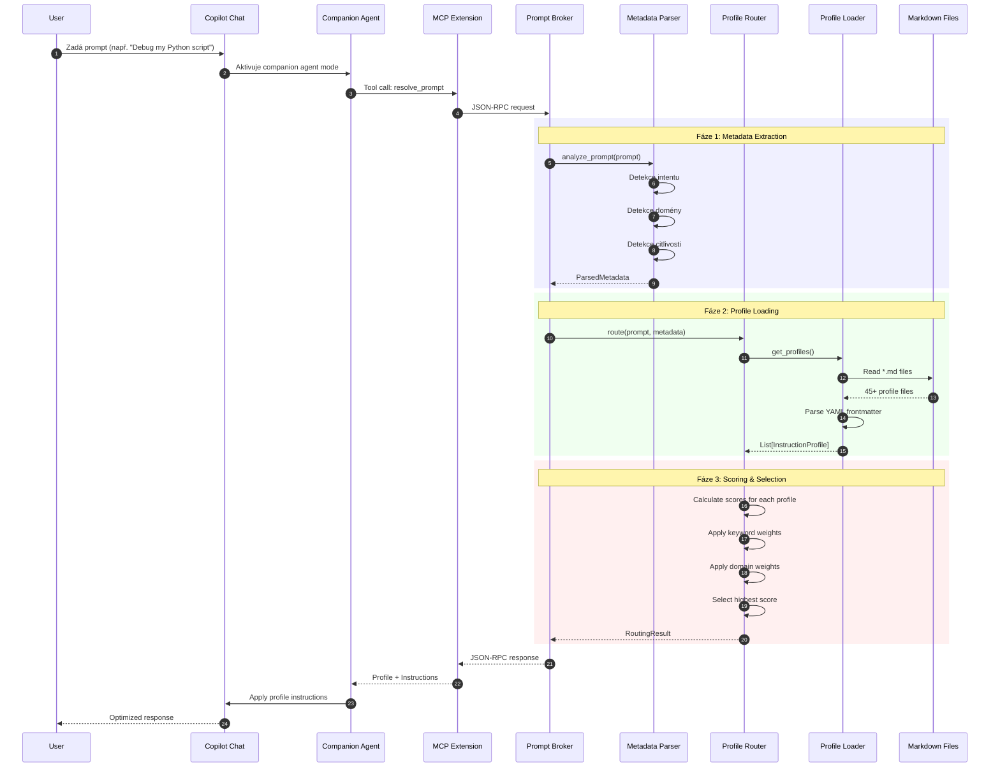
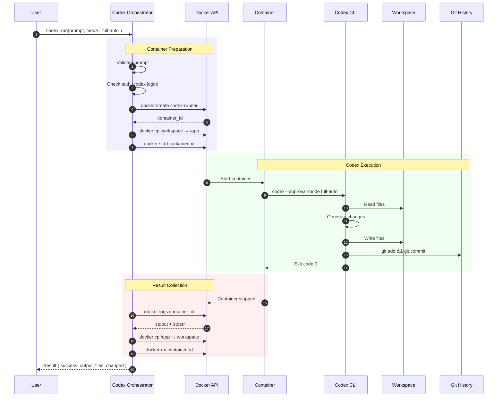
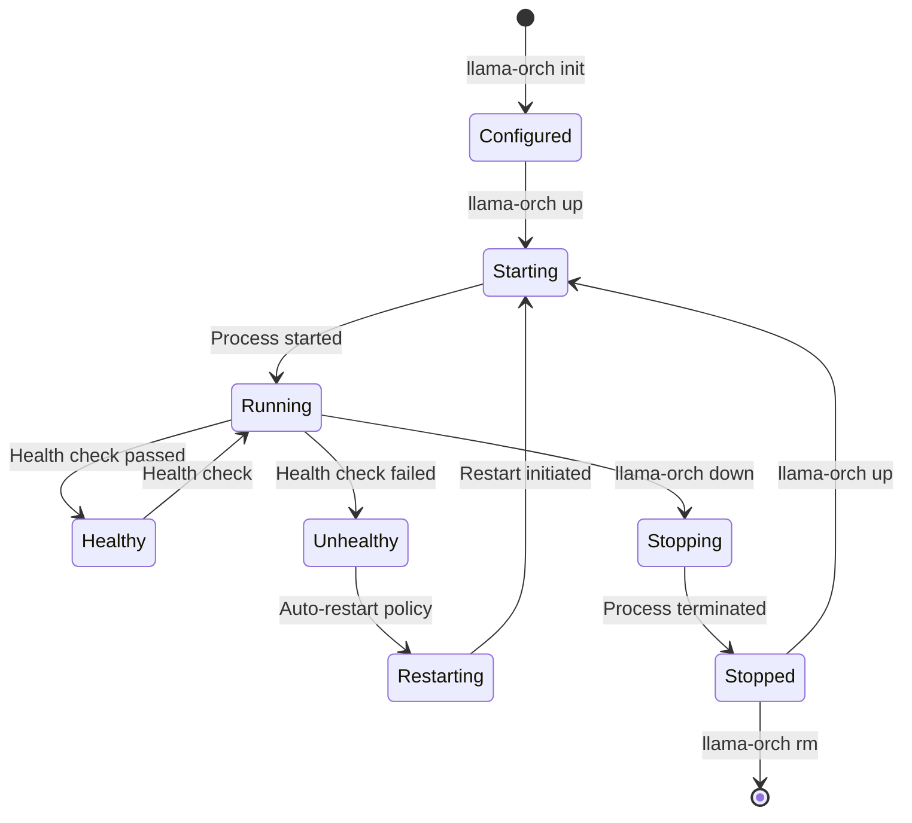

# Datový tok v MCP Prompt Broker Ekosystému

> **Verze dokumentace:** 1.0.0  
> **Datum:** 31. prosince 2025  
> **Úroveň:** 2/4 - Architecture Detail

---

## 📋 Obsah

1. [Přehled datových toků](#přehled-datových-toků)
2. [Profile Routing Flow](#profile-routing-flow)
3. [Metadata Enrichment Pipeline](#metadata-enrichment-pipeline)
4. [Codex Execution Flow](#codex-execution-flow)
5. [Llama Instance Management Flow](#llama-instance-management-flow)
6. [Datové formáty](#datové-formáty)

---

## Přehled datových toků

```
┌─────────────────────────────────────────────────────────────────────────────┐
│                           DATA FLOW OVERVIEW                                │
├─────────────────────────────────────────────────────────────────────────────┤
│                                                                             │
│  ┌─────────┐     ┌─────────────┐     ┌─────────────┐     ┌─────────────┐   │
│  │  User   │────▶│   Prompt    │────▶│  Metadata   │────▶│   Profile   │   │
│  │ Request │     │   Input     │     │ Enrichment  │     │  Routing    │   │
│  └─────────┘     └─────────────┘     └─────────────┘     └─────────────┘   │
│                                                                  │          │
│                                                                  ▼          │
│  ┌─────────┐     ┌─────────────┐     ┌─────────────┐     ┌─────────────┐   │
│  │  User   │◀────│  Optimized  │◀────│ Instructions│◀────│   Profile   │   │
│  │Response │     │  Response   │     │   Applied   │     │  Selected   │   │
│  └─────────┘     └─────────────┘     └─────────────┘     └─────────────┘   │
│                                                                             │
└─────────────────────────────────────────────────────────────────────────────┘
```

---

## Profile Routing Flow

### Detailní sekvenční diagram



### Datové struktury

#### Vstup: User Prompt

```json
{
  "prompt": "Debug my Python script that throws KeyError on line 42",
  "metadata": {}  // Optional overrides
}
```

#### Mezivýsledek: ParsedMetadata

```json
{
  "intent": "debugging",
  "domain": "engineering",
  "topics": ["python", "debugging", "error_handling"],
  "sensitivity": "low",
  "safety_score": 0,
  "tone": "neutral",
  "complexity": "medium"
}
```

#### Výstup: RoutingResult

```json
{
  "profile": {
    "name": "technical_support",
    "instructions": "You are a technical support specialist...",
    "required": {
      "context_tags": ["debugging", "troubleshooting"]
    },
    "weights": {
      "domain": {"engineering": 4, "python": 3},
      "keywords": {"debug": 5, "error": 4, "fix": 3}
    },
    "default_score": 1,
    "fallback": false
  },
  "metadata": {
    "prompt": "Debug my Python script...",
    "intent": "debugging",
    "domain": "engineering",
    "topics": ["python", "debugging"],
    "sensitivity": "low",
    "complexity": "medium"
  },
  "routing": {
    "score": 24,
    "consistency": 87.5
  }
}
```

---

## Metadata Enrichment Pipeline

### Pipeline fáze

```
┌─────────────────────────────────────────────────────────────────────────────┐
│                      METADATA ENRICHMENT PIPELINE                           │
├─────────────────────────────────────────────────────────────────────────────┤
│                                                                             │
│  Raw Prompt                                                                 │
│  "Analyze patient health records for treatment patterns"                    │
│       │                                                                     │
│       ▼                                                                     │
│  ┌─────────────────────────────────────────────────────────────────────────┤
│  │  STAGE 1: Intent Detection                                              │
│  │  ├── Keywords: "analyze", "patterns" → intent: "analysis"               │
│  │  └── Confidence: 0.85                                                   │
│  └─────────────────────────────────────────────────────────────────────────┤
│       │                                                                     │
│       ▼                                                                     │
│  ┌─────────────────────────────────────────────────────────────────────────┤
│  │  STAGE 2: Domain Detection                                              │
│  │  ├── Keywords: "patient", "health", "treatment" → domain: "healthcare"  │
│  │  └── Confidence: 0.92                                                   │
│  └─────────────────────────────────────────────────────────────────────────┤
│       │                                                                     │
│       ▼                                                                     │
│  ┌─────────────────────────────────────────────────────────────────────────┤
│  │  STAGE 3: Sensitivity Detection                                         │
│  │  ├── PII indicators: "patient", "health records" → sensitivity: "high" │
│  │  └── HIPAA relevance: true                                              │
│  └─────────────────────────────────────────────────────────────────────────┤
│       │                                                                     │
│       ▼                                                                     │
│  ┌─────────────────────────────────────────────────────────────────────────┤
│  │  STAGE 4: Topic Extraction                                              │
│  │  ├── Topics: ["healthcare", "data_analysis", "privacy"]                 │
│  │  └── Primary topic: "healthcare"                                        │
│  └─────────────────────────────────────────────────────────────────────────┤
│       │                                                                     │
│       ▼                                                                     │
│  ┌─────────────────────────────────────────────────────────────────────────┤
│  │  STAGE 5: Complexity Assessment                                         │
│  │  ├── Multi-step: true                                                   │
│  │  ├── Domain expertise required: true                                    │
│  │  └── Complexity: "complex"                                              │
│  └─────────────────────────────────────────────────────────────────────────┤
│       │                                                                     │
│       ▼                                                                     │
│  Enriched Metadata                                                          │
│  {                                                                          │
│    "intent": "analysis",                                                    │
│    "domain": "healthcare",                                                  │
│    "sensitivity": "high",                                                   │
│    "topics": ["healthcare", "data_analysis", "privacy"],                    │
│    "complexity": "complex"                                                  │
│  }                                                                          │
│                                                                             │
└─────────────────────────────────────────────────────────────────────────────┘
```

---

## Codex Execution Flow

### Container Lifecycle



### Datové struktury

#### Vstup: codex_run request

```json
{
  "prompt": "Refactor the authentication module to use async/await",
  "mode": "full-auto",
  "timeout": 300,
  "repo": "/workspace",
  "working_dir": "src/auth"
}
```

#### Výstup: codex_run response

```json
{
  "success": true,
  "exit_code": 0,
  "output": "Successfully refactored 3 files...",
  "files_changed": [
    "src/auth/login.py",
    "src/auth/session.py",
    "src/auth/middleware.py"
  ],
  "execution_time_ms": 45230,
  "container_id": "abc123def456"
}
```

---

## Llama Instance Management Flow

### Instance Lifecycle



### Health Check Flow

```
┌─────────────────────────────────────────────────────────────────────────────┐
│                         HEALTH CHECK FLOW                                   │
├─────────────────────────────────────────────────────────────────────────────┤
│                                                                             │
│  Daemon (Background)                                                        │
│       │                                                                     │
│       ▼                                                                     │
│  ┌─────────────┐     ┌─────────────┐     ┌─────────────┐                   │
│  │  Timer      │────▶│  For each   │────▶│   HTTP GET  │                   │
│  │  (30s)      │     │  instance   │     │   /health   │                   │
│  └─────────────┘     └─────────────┘     └─────────────┘                   │
│                                                 │                           │
│                            ┌────────────────────┴────────────────────┐      │
│                            ▼                                         ▼      │
│                     ┌─────────────┐                           ┌─────────────┤
│                     │  Status 200 │                           │  Timeout/   │
│                     │  Healthy    │                           │  Error      │
│                     └─────────────┘                           └─────────────┤
│                            │                                         │      │
│                            ▼                                         ▼      │
│                     ┌─────────────┐                           ┌─────────────┤
│                     │  Update     │                           │  Increment  │
│                     │  last_seen  │                           │  fail_count │
│                     └─────────────┘                           └─────────────┤
│                                                                      │      │
│                                                  fail_count >= 3 ?   │      │
│                                                         │            │      │
│                                            ┌────────────┴────────────┤      │
│                                            ▼                         ▼      │
│                                     ┌─────────────┐           ┌─────────────┤
│                                     │  Restart    │           │  Wait for   │
│                                     │  Instance   │           │  next check │
│                                     └─────────────┘           └─────────────┤
│                                                                             │
└─────────────────────────────────────────────────────────────────────────────┘
```

---

## Datové formáty

### Profile Markdown Format

```markdown
---
name: technical_support
description: Profil pro technickou podporu a debugging
version: 1.0.0
domains:
  - engineering
  - debugging
capabilities:
  - troubleshooting
  - diagnostics
complexity: simple
keywords:
  debug: 5
  error: 4
  fix: 3
  issue: 2
---

# Technical Support Profile

You are a technical support specialist focused on debugging and troubleshooting...

## Checklist

- [ ] Identify the error type
- [ ] Reproduce the issue
- [ ] Find root cause
- [ ] Propose solution
- [ ] Verify fix
```

### Central Metadata Registry (profiles_metadata.json)

```json
{
  "version": "1.0.0",
  "generated_at": "2025-12-31T10:00:00Z",
  "profiles": {
    "technical_support": {
      "name": "technical_support",
      "description": "Profil pro technickou podporu",
      "domains": ["engineering", "debugging"],
      "capabilities": ["troubleshooting", "diagnostics"],
      "complexity": "simple",
      "file_path": "copilot-profiles/technical_support.md"
    }
  },
  "statistics": {
    "total_profiles": 45,
    "domains_covered": 12,
    "capabilities_covered": 18
  }
}
```

### Instance Configuration (llama-orchestrator)

```json
{
  "name": "gpt-oss",
  "model": {
    "path": "../../models/gpt-oss-20b-Q4_K_S.gguf",
    "context_size": 4096,
    "batch_size": 512,
    "threads": 16
  },
  "server": {
    "host": "127.0.0.1",
    "port": 8001,
    "parallel": 4
  },
  "gpu": {
    "layers": 0,
    "backend": "vulkan"
  },
  "health": {
    "interval_seconds": 30,
    "timeout_seconds": 5,
    "max_failures": 3
  },
  "restart": {
    "policy": "on-failure",
    "max_retries": 5,
    "backoff_seconds": 10
  }
}
```

---

## Související dokumenty

- **Architektura:** [ARCHITECTURE.md](ARCHITECTURE.md)
- **Integrace:** [INTEGRATION.md](INTEGRATION.md)
- **API Reference:** [../api/MCP_TOOLS.md](../api/MCP_TOOLS.md)

---

*Tato dokumentace je součástí 4-úrovňové dokumentační struktury projektu MCP Prompt Broker.*
