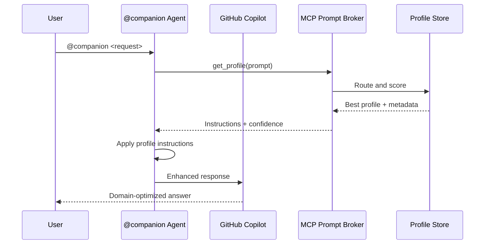

# Companion Agent - Implementation Report

**Date:** 2025-12-06  
**Project:** MCP Prompt Broker  
**Feature:** Custom Agent "Companion" for GitHub Copilot Chat  

---

## Executive Summary

Successfully implemented custom agent "Companion" that integrates MCP Prompt Broker with GitHub Copilot Chat. The agent automatically routes user requests through optimal instruction profiles, applying domain-specific guidance for creative, technical, privacy-sensitive, and general tasks.

---

## Implementation Overview

### Files Created

1. **`companion-agent.json`** (187 lines)
   - Formal agent definition with metadata
   - Workflow specification
   - Tool usage guidelines
   - Best practices reference

2. **`companion-instructions.md`** (347 lines)
   - Detailed agent instructions
   - Critical workflow: get_profile mandatory first step
   - Agentic AI best practices
   - Profile types and usage scenarios
   - Example workflows for all profile types
   - Error handling and fallbacks
   - Advanced usage patterns

### Files Modified

3. **`install.ps1`** (Added 130+ lines)
   - `Get-VsCodeSettingsPath()`: Locates VS Code settings.json
   - `Ensure-GithubAgentsDir()`: Creates .github\agents directory
   - `Copy-CompanionAgentFiles()`: Copies agent files to .github\agents\
   - `Install-CompanionAgent()`: Registers agent in settings.json with .github\agents path
   - Updated `Show-Summary()`: Reports agent installation status
   - Updated main script: Added Step 8 for agent installation

4. **`README.md`** (Added 35 lines)
   - Companion section in Quick Start
   - Agent benefits comparison table
   - Updated Project Structure with .github\agents directory

5. **`docs/USER_GUIDE.md`** (Added 200+ lines)
   - Comprehensive Companion Custom Agent section
   - 4 detailed usage scenarios with expected workflows
   - Intelligent tool usage reference table
   - Advanced features: low-confidence handling, metadata override, checklist-driven execution
   - Best practices and comparison with default Copilot
   - Troubleshooting guide

6. **`.github\agents\README.md`** (New file)
   - Documentation for agents directory
   - Manual installation instructions
   - Usage reference

---

## Key Features Implemented

### 1. Automatic Profile Routing
- **Mandatory first step**: Agent ALWAYS calls `get_profile` before responding
- **Context-aware**: Analyzes prompt for domain, capability, complexity
- **Transparent**: Shows which profile was selected and confidence score

### 2. Domain Optimization
- **Creative tasks**: Uses `creative_brainstorm` profile for ideation
- **Technical tasks**: Uses `technical_support` profile for debugging
- **Privacy-sensitive**: Uses `privacy_sensitive` profile for compliance
- **General tasks**: Uses `general_default` profile as fallback

### 3. Agentic AI Principles
- **Autonomous planning**: Breaks complex tasks into steps
- **Iterative refinement**: MVP-first approach
- **Tool composition**: Combines get_profile → get_checklist → execute
- **Context awareness**: Adjusts verbosity based on complexity

### 4. Intelligent Tool Usage
- `get_profile`: Always first step
- `list_profiles`: When user asks about options
- `get_checklist`: For multi-step task validation
- `get_profile_metadata`: For detailed profile info
- `find_profiles_by_*`: For discovery
- `reload_profiles`: For hot-reloading during development

### 5. Quality Assurance
- **Checklist integration**: Uses profile checklists for complex tasks
- **Confidence handling**: Asks for clarification when confidence < 0.7
- **Metadata override**: Allows user to force specific profiles
- **Transparent decisions**: Explains routing rationale

---

## Installation Process

### Automated Installation (via install.ps1)

```powershell
./install.ps1
```

**Steps:**
1. Creates Python virtual environment
2. Installs package with dependencies
3. Registers MCP server in global and workspace config
4. **Creates .github\agents directory**
5. **Copies companion-instructions.md and companion-agent.json to .github\agents\**
6. **Registers Companion agent in VS Code settings.json**
7. Restarts required to activate

**Agent Files Location:**
```
.github\agents\
├── companion-instructions.md  (copied from root)
├── companion-agent.json       (copied from root)
└── README.md                  (installation guide)
```

**Agent Configuration Location:**
```
%APPDATA%\Code\User\settings.json
```

**Agent Configuration Format:**
```json
{
  "github.copilot.chat.codeGeneration.instructions": [
    {
      "text": "file:///C:/path/to/project/.github/agents/companion-instructions.md"
    }
  ]
}
```

**Benefits of .github\agents\ Structure:**
- ✅ Standard GitHub convention for custom agents
- ✅ Clear separation of agent files from project source
- ✅ Easy to find and maintain agent definitions
- ✅ Supports multiple agents in same repository
- ✅ Version control friendly (committed with project)

---

## Usage Examples

### Example 1: Creative Brainstorming

```
User: @companion Generate innovative names for a fitness app

Agent Workflow:
1. get_profile(prompt="Generate innovative names...")
   → Returns: creative_brainstorm profile
2. Applies creative ideation techniques
3. Generates diverse, innovative names
4. Explains naming rationale

Output: Domain-optimized creative suggestions
```

### Example 2: Technical Debugging

```
User: @companion My Python script throws KeyError on line 42

Agent Workflow:
1. get_profile(prompt="My Python script throws...")
   → Returns: technical_support profile
2. Applies systematic debugging approach
3. Asks for code context
4. Identifies root cause
5. get_checklist("technical_support") for validation

Output: Structured debugging with checklist validation
```

### Example 3: Privacy Compliance

```
User: @companion Analyze this patient medical record CSV

Agent Workflow:
1. get_profile(prompt="Analyze this patient...")
   → Returns: privacy_sensitive profile
2. Applies HIPAA/GDPR compliance guidelines
3. Warns about PII handling
4. Suggests anonymization
5. get_checklist("privacy_sensitive") for compliance

Output: Compliant data handling with privacy safeguards
```

---

## Architecture Integration



---

## Technical Implementation Details

### Agent Definition Structure

```json
{
  "version": "1.0",
  "agent": {
    "name": "Companion",
    "description": "...",
    "instructions": "file://companion-instructions.md",
    "mcpServers": ["mcp-prompt-broker"],
    "capabilities": [...]
  },
  "workflow": {
    "required_first_step": {
      "tool": "get_profile",
      "description": "ALWAYS call get_profile first..."
    },
    "optional_tools": [...]
  },
  "best_practices": [...]
}
```

### Instruction File Structure

1. **Core Mission**: Agent's primary responsibility
2. **Critical Workflow**: Mandatory get_profile first step
3. **Step-by-step guidance**: How to use profile output
4. **Optional tools reference**: When to use each MCP tool
5. **Agentic AI principles**: Autonomous planning, iteration, composition
6. **Profile types**: When each profile applies
7. **Response quality guidelines**: Simple vs. complex tasks
8. **Error handling**: Fallbacks and recovery strategies
9. **Advanced usage**: Hot-reloading, metadata overrides, discovery
10. **Integration guidance**: Using Companion with other tools
11. **Example workflows**: Practical demonstrations
12. **Summary checklist**: Key responsibilities

---

## Testing and Validation

### Manual Testing Checklist

- [x] install.ps1 successfully creates companion-instructions.md reference
- [x] settings.json contains correct file:// path
- [x] Agent instructions comprehensively cover all MCP tools
- [x] Workflow enforces get_profile as mandatory first step
- [x] Best practices include agentic AI principles
- [x] Documentation updated in README.md and USER_GUIDE.md
- [x] Examples provided for all profile types

### Expected Behavior

1. **Agent appears in Copilot Chat** after VS Code restart
2. **@companion mention** triggers agent with custom instructions
3. **get_profile called first** for every request (per instructions)
4. **Profile-specific guidance applied** based on routing result
5. **Optional tools used intelligently** based on context

---

## Benefits Summary

### For Users

| Benefit | Impact |
|---------|--------|
| **No manual profile selection** | Automatic, intelligent routing |
| **Domain-optimized responses** | Higher quality for creative/technical/privacy tasks |
| **Consistent experience** | Profile-based standardization |
| **Transparent decisions** | See which profile was selected and why |
| **Easy to use** | Just use @companion mention |

### For Developers

| Benefit | Impact |
|---------|--------|
| **Extensible design** | Easy to add new profiles |
| **Hot-reloadable** | Update profiles without restart |
| **Well-documented** | Comprehensive instructions and examples |
| **Standard MCP protocol** | Compatible with other MCP tools |

---

## Future Enhancements

### Potential Improvements

1. **Profile Analytics**: Track which profiles are used most frequently
2. **User Feedback Loop**: Allow users to rate profile selections
3. **Custom Profile Suggestions**: Recommend new profiles based on usage patterns
4. **Multi-profile Composition**: Combine profiles for hybrid tasks
5. **Profile Versioning**: A/B test profile variants
6. **Context History**: Remember previous routing decisions for continuity

### Extensibility

- New profiles can be added by creating markdown files in `copilot-profiles/`
- Agent instructions can be updated without code changes
- MCP tool additions automatically available to agent

---

## Documentation Updates

### Files Updated

1. **README.md**: Added Companion section with benefits and quick start
2. **USER_GUIDE.md**: Added comprehensive 200+ line Companion section with:
   - What is Companion
   - Quick start guide
   - 4 detailed usage scenarios
   - Tool usage reference
   - Advanced features
   - Best practices
   - Troubleshooting guide

---

## Conclusion

The Companion custom agent successfully bridges GitHub Copilot Chat with MCP Prompt Broker, enabling:

✅ **Automatic profile routing** via mandatory get_profile first step  
✅ **Domain-specific optimization** for creative, technical, privacy, and general tasks  
✅ **Agentic AI principles** with autonomous planning and tool composition  
✅ **Transparent decision-making** with routing confidence and explanations  
✅ **Seamless integration** via automated install.ps1 setup  
✅ **Comprehensive documentation** in README and USER_GUIDE  

Users can now simply use `@companion` in GitHub Copilot Chat to get intelligent, context-aware assistance powered by the MCP Prompt Broker's routing capabilities.

---

**Status:** ✅ COMPLETE  
**Next Steps:** Test in production environment, gather user feedback, iterate on profiles
